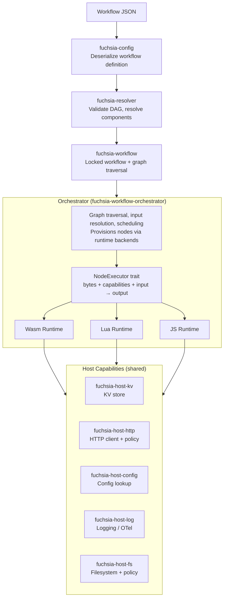
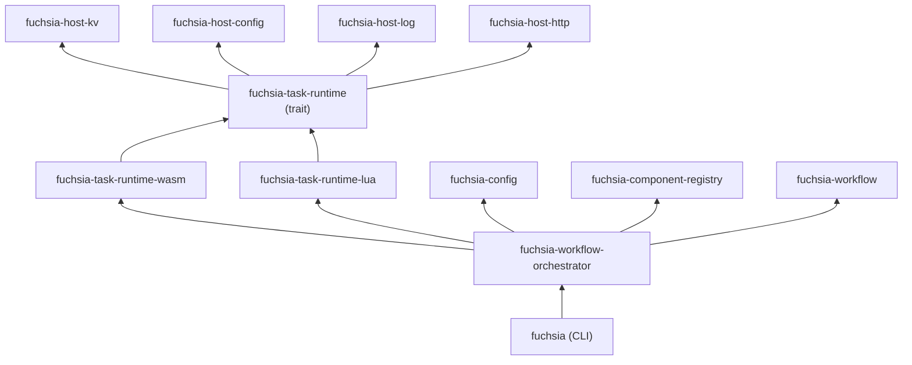

# Architecture Overview

## System Diagram

## Dependency Graph

## Key Principles

- **Bytes in, JSON out** — The runtime trait takes raw bytes (wasm binary, Lua source, JS source) and structured input, returns structured output. Each runtime interprets the bytes in its own way.
- **One implementation per host capability** — KV, HTTP, logging, config, filesystem are each implemented in a single crate. Runtimes write thin glue to wire their VM's FFI to these shared implementations.
- **Orchestrator is runtime-agnostic** — The orchestrator resolves workflows into nodes, provisions them using whatever runtime is registered, and executes them. It never touches wasmtime, mlua, or any VM directly.
- **Runtimes own their lifecycle** — Each runtime manages its own caching, compilation, and instance creation internally. Wasmtime compiles once and caches `Component`. Lua reads the source. The orchestrator doesn't care.
- **Manual invocation with payload** — Workflows are kicked off by calling `Orchestrator::invoke(payload, cancel)` with a JSON payload. Nodes with no incoming edges (entry points) receive the payload as their upstream context.
