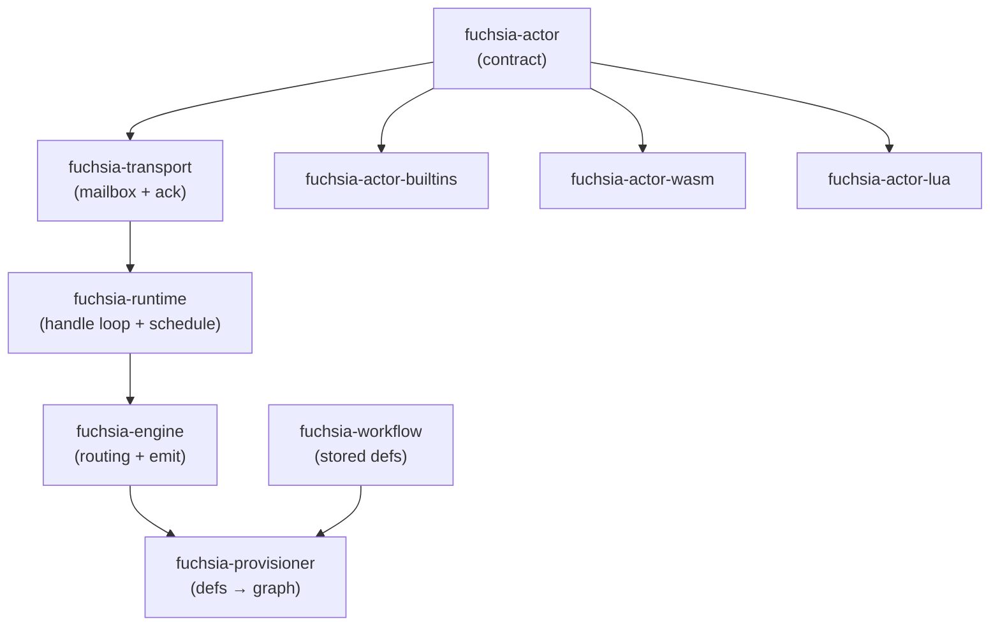

# Crate Map

Fuchsia is a stack of small crates. `fuchsia-actor` is the contract everything
depends on; each layer above adds one concern. Hosts depend on whichever subset
they need.

## Crates

| Crate | Role | Key dependencies |
|-------|------|------------------|
| `fuchsia-actor` | The contract: `Actor` trait, `ActorCreator`/`ActorFactory`, `ActorCapabilities` (`Emit`/`Schedule`/`StateSink`), `Message`/`MessageValue`, `ActorContext`, `ActorConfig`, `ActorId`, `ActorError`, `COMPONENT_ENV_KEY`. Intentionally lean so actor packs don't pull in the engine. | `bson`, `serde_json`, `thiserror` |
| `fuchsia-transport` | Message delivery plumbing: the bounded `mailbox` (mpsc of `Delivery`), `Delivery` (message + `Ack` + trace span), `Ack` (`Health` at-most-once / `Complete` at-least-once), `Offer`. No `Transport` trait — durability is layered in front of the channel. | `fuchsia-actor`, `tokio[sync]`, `tracing` |
| `fuchsia-runtime` | The actor substrate. `Runtime` owns the recv→handle→ack loop (one tokio task per actor), runs the lifecycle, and provides the `schedule` capability (`TokioSchedule`). `ActorRegistry` is the live address book of `ActorHandle`s. Criterion bench under `benches/`. | `fuchsia-actor`, `fuchsia-transport`, `tokio`, `tracing`, `thiserror` |
| `fuchsia-engine` | Routing between actors per a graph's edges. `Engine` (shareable as `Arc`) does `add_node`/`add_edge`/`remove_graph`/`push` over a live `RouterState`, and provides the `emit` capability (`RoutedEmit`). Knows only actors + addressing. | `fuchsia-actor`, `fuchsia-runtime`, `fuchsia-transport`, `tokio[sync]`, `thiserror` |
| `fuchsia-workflow` | Persisted workflow definitions and Slate-backed CRUD. `Workflow`/`Node`/`NodeDefinition` (`Builtin`\|`Component`), `BuiltinConfig`, `ComponentConfig`, `Edge`, `Trigger`, plus structural `validate`. | `slate-db`/`-store`/`-query`, `bson`, `serde`, `thiserror` |
| `fuchsia-provisioner` | Translates a stored `Workflow` into engine `add_node`/`add_edge` calls (group = workflow id). Maps builtin → type name, component → per-runtime type + component id in `env`. | `fuchsia-actor`, `fuchsia-engine`, `fuchsia-workflow`, `thiserror` |
| `fuchsia-actor-builtins` | Native builtin actors: `passthrough`, `debounce`, `deadband`, `dedup`, `commit`, plus `register`. | `fuchsia-actor`, `bson`, `serde`, `serde_json` |
| `fuchsia-actor-wasm` | Wasm-component-hosting actors. `WasmActor<H: WasmHost>` + `WasmActorCreator<H>` (one creator per `"wasm"` runtime, component catalog) + `BaseHost` (contract-only). Synchronous wasmtime. | `fuchsia-actor`, `wasmtime[component-model]`, `serde_json`, `tracing` |
| `fuchsia-actor-lua` | Lua-script-hosting actors. `LuaActor<H: LuaHost>` + `LuaActorCreator<H>` (one creator per `"lua"` runtime, script catalog) + `BaseLuaHost`. Synchronous mlua. | `fuchsia-actor`, `mlua[lua54,send,vendored]` (pinned `0.11`), `serde_json`, `tracing` |
| `fuchsia-examples` | Runnable demo wiring a Lua actor, a builtin, and a Wasm component into one engine graph (`cargo run -p fuchsia-examples`). | the four actor/engine crates above, `tokio`, `serde_json` |

## Dependency flow

`fuchsia-actor` is the only crate everyone depends on. The actor implementations
(builtins, wasm, lua) depend on the contract and nothing else in the stack — they
don't know about the runtime or engine. The provisioner is the top: it joins the
stored definitions (`fuchsia-workflow`) to the live engine.

## Test components

- `test-components/actor-echo/` — a small wasm component built against only
  `fuchsia:actor` (imports `emit`, exports the lifecycle), used by the
  `fuchsia-actor-wasm` integration test. Its own standalone cargo workspace;
  requires `cargo component build --release`. The test skips if the artifact is
  absent.

## WIT

- `wit/` ships **only** the `fuchsia:actor` package — `actor.wit` (lifecycle),
  `types.wit` (`payload`), `emit.wit`. There is **no bundled platform world** and
  no http/log/wasi interfaces; products compose their own worlds, and the base
  host defines its contract-only world inline in `bindgen!`.

## What's not here

Things you might expect as crates and don't, because they're host concerns:

- **No `fuchsia-capabilities` / HTTP.** The core capability set is `emit` /
  `schedule` / `state` — all synchronous, all host-agnostic. HTTP, KV, MQTT, BLE
  are product capabilities, wired through a product's `WasmHost` / `LuaHost`.
- **No component registry / artifact store.** Hosts decide where components and
  scripts live and how they're versioned; creators accept already-loaded
  artifacts into their catalog.
- **No CLI.** Fuchsia is a library. `fuchsia-examples` shows the embedding shape.
