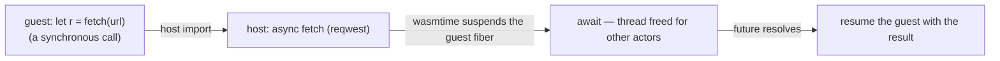

# RFC: Async Actor Contract

> **Status: implemented.** The `Actor` lifecycle is async across all packs — wasm
> drives guests via wasmtime async exports (`call_async`), lua via `mlua` async — and
> awaited I/O in `handle` yields the runtime thread instead of blocking it.
> Foundational. The guest WIT contract stays synchronous.

## Concept

The `Actor` lifecycle becomes asynchronous: `setup`, `handle`, and `teardown` are
`async`. A handle can `.await` an I/O capability (an HTTP call, a DB query) without
blocking its runtime thread — other actors run meanwhile. Per-actor semantics are
unchanged: one handle in flight per actor, `&mut self` with no locking, messages
processed sequentially. The guest **WIT contract stays synchronous** — the wasm host
drives guests via wasmtime's async support, so guest authors still write straight-line
synchronous code while the host does the real async underneath.

## Motivation

Fuchsia's targets are I/O-bound. An n8n-style orchestrator *is* connectors
(HTTP/DB/SaaS); an HA-style hub's actions are device/service calls. An I/O-bound
handle is the common case, not the exception. With a synchronous `handle`, each such
call blocks the actor's runtime thread for its full duration; with one task per actor
on a shared worker pool, a handful of slow nodes starve the whole engine.
`spawn_blocking` defers it but costs a thread per in-flight blocking handle —
memory-heavy and capped, no good for thousands of concurrent runs awaiting HTTP. Async
is the honest model for an I/O orchestrator.

And the contract is **young** — a few actor packs, one downstream (libra-rs) barely
started — so this is the cheapest moment to change it; the migration cost only grows.

## Design

**`fuchsia-actor` (contract).** The trait goes async:

```rust
#[async_trait]
pub trait Actor: Send + 'static {
    async fn setup(&mut self, ctx: &ActorContext) -> Result<(), ActorError>;
    async fn handle(&mut self, ctx: &ActorContext, msg: Message) -> Result<(), ActorError>;
    async fn teardown(&mut self, ctx: &ActorContext) -> Result<(), ActorError>;
}
```

Because actors are `Box<dyn Actor>` and native `async fn` in traits (RPITIT) isn't
dyn-compatible, the returned futures are boxed — via the `async-trait` macro or a
hand-written `Pin<Box<dyn Future + Send + '_>>`. That's a heap allocation per call;
see the perf gate.

**The core capabilities stay synchronous.** `Emit::emit` and
`Schedule::schedule_self` are fire-and-forget (offer to a mailbox / arm a timer and
return) — no reason to make them async. Only the *lifecycle* goes async, plus any
**product** capability that does real I/O, which the product defines as its own async
trait and injects through the bag / host seam.

**`fuchsia-runtime` (the loop).** `run_actor` awaits each handle:

```rust
while let Some(delivery) = rx.recv().await {
    let outcome = actor.handle(&ctx, msg).await;   // yields the thread while awaiting I/O
    ack.report(outcome);
}
actor.teardown(&ctx).await;
```

Still **one handle in flight per actor** (awaited before the next `recv`), so `&mut
self` is held across the await but only ever by this single task — sound, no locking.
The only change from today: awaiting I/O *yields the worker thread* to other actors
instead of blocking it.

**`fuchsia-actor-wasm` — sync WIT, async host.** Switch the host to wasmtime
`async_support`: guest exports (`setup`/`handle`/`teardown`) are called as futures and
host imports are async. The **WIT is unchanged** — the guest calls imports
synchronously. When a guest calls an async host import (e.g. an injected `fetch`),
wasmtime suspends the guest's fiber until the Rust future resolves, then resumes it —
no OS thread blocked. Guest authors keep writing straight-line code; the async lives
entirely on the host side.



**`fuchsia-actor-lua` / JS.** mlua and rquickjs both back coroutines/promises with
Rust futures (their async features), so a Lua `coroutine` / a JS `await` maps to an
awaited Rust future on the host. (A pack may also stay blocking and run on a blocking
pool if that's simpler — see open questions.)

## What stays the same

- **Per-actor sequential** — one message handled at a time per actor; ordering and
  `&mut self`-without-locking are preserved.
- **Guest authoring** — WIT stays synchronous; Lua/JS authors write straight-line
  scripts.
- **The capability bag, `emit`, `schedule`, routing** — unchanged (`emit`/`schedule`
  stay sync).

## What this does NOT solve

Async removes *thread* blocking, not per-node *serialization*. With the persistent
graph model ([runs & result correlation](./runs-and-results.md)), concurrent runs
through one shared actor still handle one-at-a-time (one `.await` in flight). A hot
shared I/O node is still a serialization point; true per-node concurrency is
**operator parallelism** (a separate, deferred lever) or ephemeral-per-run graphs.
Async is necessary, not sufficient, for high-concurrency through a single node.

## Interactions

- **[Graceful shutdown](./graceful-shutdown.md):** "settled" now means in-flight
  *async* handles have completed; the deadline bounds awaited I/O (a node stuck on a
  slow request is force-stopped at the deadline).
- **[Node failure handling](./node-failure-handling.md):** a panic or error in an
  async handle is caught the same way (the task's `JoinHandle`); death detection is
  unchanged.
- **JavaScript / I/O capabilities:** this is what makes `await fetch()` real rather
  than thread-blocking; the JavaScript actor RFC builds on it.

## Alternatives considered

- **Stay synchronous; `spawn_blocking` for I/O actors.** No contract change, but a
  thread per in-flight blocking handle — memory-heavy, capped, poor for thousands of
  concurrent runs on HTTP. Fine as an *escape hatch* for a genuinely blocking native
  library; wrong as the model. Rejected as the default.
- **Two traits — sync `Actor` and async `AsyncActor`.** Avoids touching simple
  actors, but it's two contracts, two runtime paths, and a fork in every pack.
  Rejected — one async trait subsumes sync (a sync handler is an `async fn` with no
  `.await`).
- **Component-model native async (Preview 3 async WIT, streams/futures).** Not
  shipped/stable, and it would make async *guest-visible* — unnecessary. We keep sync
  WIT + host-side wasmtime async instead. Rejected for now.

## Resolved

- **Dyn-async mechanism** → `async-trait`, re-exported as `fuchsia_actor::async_trait`
  (boxed futures, one alloc per call). `WasmHost`/`LuaHost` use it too.
- **Compute-path overhead** → benched sync vs async on the runtime micro-benches:
  roundtrip 308 ns → 336 ns (+~28 ns/handle, the `Box::pin`), spawn 751 → 865 ns.
  Negligible for I/O-bound handles; no fast-path needed. Revisit only if an
  ultra-hot conditioning path ever demands it.
- **Docs / identity** → the "synchronous handle-per-message, no async bridge" framing
  was revised across `AGENTS.md`, the intro, and the runtime/engine/wasm/lua pages
  alongside this implementation. The *guest* contract (WIT) stays synchronous; the
  Rust `Actor` trait is async.

## Open questions

- **Blocking escape hatch.** For a native capability that *can't* be made async (a
  blocking C lib), run that actor's handle on a blocking pool (`spawn_blocking`)? A
  per-actor "blocking" flag, or leave it to the capability? Deferred until a real
  case appears.
