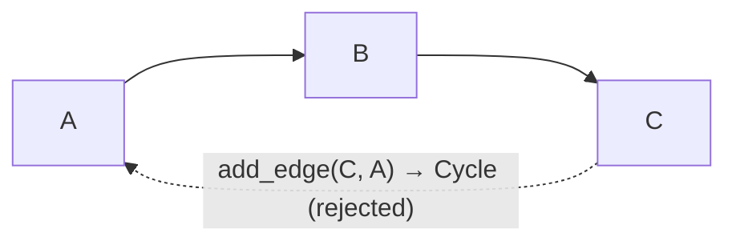

# RFC: DAG Enforcement

> **Status: implemented.** `add_edge` rejects cycle-creating edges in
> `fuchsia-engine`; a running graph is always acyclic. See the
> [roadmap](../reference/roadmap.md).

## Concept

Fuchsia graphs are acyclic. `add_edge(from, to)` **rejects any edge that would close
a cycle** — returning a new `EngineError::Cycle` and leaving the graph unchanged — so
a running graph can never contain a back-edge. (`add_edge` already returns
`Result<(), EngineError>`, so this adds a failure case, not a signature change.)



## Motivation

- **Graceful shutdown needs it.** [Graceful shutdown](./graceful-shutdown.md) drains
  and tears down in topological order, which only terminates on a DAG — a cycle
  (`A → B → A`) has no node whose upstreams ever clear, so it could only ever hit the
  deadline.
- **Back-edge behavior is undefined today.** The engine records any edge; a cycle just
  *runs* — messages loop, and on a full mailbox the loop sheds its own iterations
  (at-most-once). There is no terminating condition and no defined semantics. Rather
  than design cycle semantics (bounded iteration, a loop construct), we pick the
  simpler contract: no cycles.
- **The target products are DAGs.** n8n workflows are acyclic — looping is an explicit
  batch/loop *node* over a sub-graph, not a graph cycle; Home Assistant automations
  are event → condition → action, acyclic. Neither needs graph cycles.
- **Fail fast.** Detecting the cycle when the edge is added gives a clear error at
  build time, instead of an invalid graph that misbehaves — or won't shut down —
  later.

## Design

**`fuchsia-engine`.** In `add_edge(from, port, to)`, after the existing port
validation and before inserting, check whether `to` can already reach `from` over
the existing edges (a reachability walk — DFS/BFS from `to`). If it can, the new
edge would close a cycle:

```rust
// reject a self-loop, or an edge whose target already reaches its source
if from == to || self.reaches(&to, &from) {
    return Err(EngineError::Cycle { from, to });
}
```

The routing table is nested by source then port
(`HashMap<ActorId, HashMap<Port, Vec<Edge>>>`), so `reaches` flattens a node's
successors **across all of its ports** — reachability ignores which port an edge
leaves by. It is an iterative DFS over a visited set (O(V + E), terminating), done
before any mutation so a rejected edge leaves the table unchanged.

Add an `EngineError::Cycle { from: ActorId, to: ActorId }` variant. Because `add_edge`
is already fallible, callers that already `?` it need no change beyond handling the new
case.

- **Cost.** The reachability check is O(V + E) over the current edges per `add_edge` —
  fine for the graph sizes here (workflows of tens of nodes). If graphs ever grow
  large, switch to incremental cycle detection (maintain a topological order, check on
  insert). Noted, not needed now.
- **Removals need no check.** Removing an edge or a graph (`remove_graph`) cannot
  create a cycle.
- **Self-loops** (`from == to`) are the trivial cycle and are rejected.

## Alternatives considered

- **Status quo — no detection, back-edges unspecified.** A cycle floods/sheds and
  graceful-shutdown can't drain it; an invalid graph fails late and mysteriously.
  Rejected.
- **Support cycles with defined semantics** (bounded iteration, a loop construct).
  More machinery for no product need; iterative work is better modeled as an explicit
  loop *node* over a sub-graph (see the loop discussion in
  [output ports](./output-ports.md)). Rejected for now.
- **Detect lazily** (at shutdown or first run) instead of at `add_edge`. Lets an
  invalid graph be built and only caught later; fail-fast at edge insertion is
  clearer. Rejected.

## Open questions

- **Error detail.** Name just the offending edge (`from`, `to`), or the full cycle
  path? The edge is simplest; a path is friendlier for a graph editor to highlight.
- **Detection strategy at scale.** Full reachability per edge vs incremental
  topological maintenance — revisit only if graph sizes grow.
