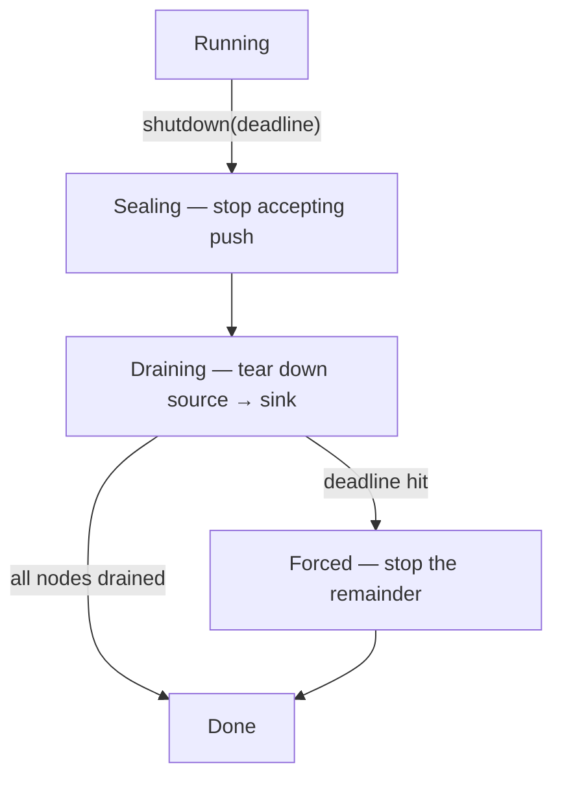
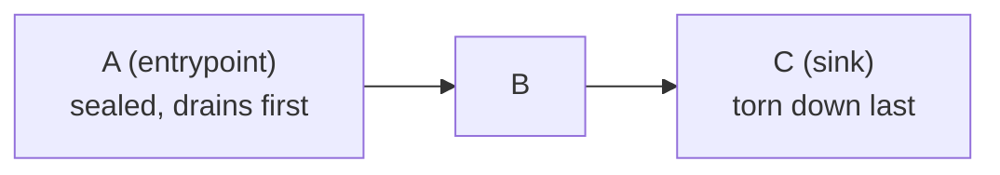

# RFC: Graceful Shutdown

> **Status: proposed.** Tracked in the [roadmap](../reference/roadmap.md#features)
> Features table until it lands.

## Concept

`engine.shutdown(deadline).await` brings the graph to rest without losing in-flight
work: **seal the entrypoints** so no new runs enter, let queued messages **drain**
through the graph, and **tear actors down in dependency order** (source → sink) —
each only after its upstreams are gone and its mailbox is empty — running each
actor's `teardown` for cleanup. A generous, engine-wide deadline bounds the wait;
past it the remaining actors are force-stopped and `shutdown` reports which nodes had
to be forced. Requires an acyclic graph (a DAG).

## Motivation

Today there is no real shutdown. Dropping the `Engine` drops the mailbox senders, so
actors eventually see their channels close, drain whatever is queued, and run
`teardown` — but nothing *awaits* that, it is uncoordinated (the router and the
registry each hold a sender clone, so a mailbox only truly closes when *both* drop),
and tearing everything down at once would deliver in-flight messages to
already-closed mailboxes, which **shed silently** (`router.rs` discards the
`Offer::Closed` — the same drop as the zombie-actor bug in
[node failure handling](./node-failure-handling.md)). A host that wants to stop
cleanly — a deploy, a SIGTERM handler, a test harness — needs to: stop accepting
input, drain what's in flight, run each actor's cleanup, and *know when it's done*,
all bounded by a deadline.

## Design

**1. Seal the entrypoints.** `shutdown` first stops `push` / `push_durable` from
accepting new external input. Internal nodes keep running and in-flight messages keep
flowing. Sealing only the front door — not internal nodes — is what lets the graph
drain without losing messages.

**2. Quiescence is runtime-observed (works for every actor flavor).** The runtime
owns every mailbox and drives the recv loop, so it tracks in-flight work for native,
Wasm, and Lua uniformly — no guest participation. A node is **drained** when its
mailbox is empty and it is not currently in `handle`; the engine knows this via an
**in-flight counter** (increment on enqueue, decrement on handle-complete) rather
than racy length-polling, and it accounts for the runtime's own pending `schedule`
timers.

Because the runtime **awaits each `handle` to completion** — an `async` `handle`
is driven to return before the next message, with no detached continuation *on the
actor side* — there is no post-`handle` async work to wait for. A host *capability*
that does fire-and-forget async work lives outside this model and is **not** awaited
by shutdown; a product that adds such a capability owns draining it. (Mid-`handle`
interruption is a separate, unaddressed concern: `handle` always runs to
completion — there is no mid-call cancellation.)

**3. Tear down source → sink, in dependency order.** The graph is a DAG, so walk it
from the entrypoints toward the sinks. Tear a node down once **(a)** all its
upstreams are already torn down (nothing can feed it) **and (b)** it is drained. Run
its `teardown` (cleanup — unsubscribe MQTT, close the device, release handles) and
remove it (closing *both* sender clones, router and registry). `teardown` does **not**
emit, so ordering exists purely to avoid delivering to a closed mailbox.

This cascades naturally: A's input is sealed → A drains → teardown A → B stops
receiving → B drains → teardown B → C. Upstream-first means a node is never removed
while something can still emit to it.

**4. Bounded by a gracious, engine-wide deadline.** `shutdown(deadline)` takes a
single deadline covering the whole engine (a future `shutdown_graph(group, deadline)`
could scope draining to one graph — e.g. on redeploy). It is generous — minutes —
because a healthy graph settles well within it. A node that has not drained by the
deadline (a wedged or very slow consumer) is force-stopped and its in-flight messages
are dropped. `shutdown` **returns the set of force-stopped nodes** (e.g.
`Vec<ActorId>`, or a small report struct) — empty means a fully graceful stop — so the
host can log/alert on what didn't drain. Past the deadline we are committed; the
deadline is the graceful → forced boundary.

**Requires a DAG.** Topological drain only terminates on an acyclic graph — a cycle
(`A → B → A`) has no node whose upstreams ever fully clear, so it could only ever hit
the deadline. Both target products are DAGs, and the engine **enforces acyclicity**
(`add_edge` rejects an edge that would create a cycle), specified separately in
[DAG enforcement](./dag-enforcement.md). That resolves the standing "cycle support"
question as *no cycles*.

## Shared primitives

Two mechanisms here are the same ones two sibling RFCs need; build them **once** in
the runtime and reference them:

- **In-flight quiescence counter** — shutdown's "drained" signal is the same per-scope
  counting that [runs & result correlation](./runs-and-results.md) deferred for
  *run-completion* detection (there, scoped per correlation id; here, per node and
  globally). One counter, two readers.
- **Task-handle tracking** — awaiting each actor's `teardown` requires the runtime to
  hold the `JoinHandle`s, which is exactly what [node failure handling](./node-failure-handling.md)
  needs to detect a *task death*. One handle registry serves both.

## Alternatives considered

- **Drop-the-engine (today).** Closes mailboxes and eventually runs `teardown`, but
  nothing awaits it, ordering is uncoordinated, and in-flight messages to
  already-closed mailboxes shed silently. Not a graceful stop. Rejected.
- **Tear everything down at once, then let it drain.** Any message in flight to a node
  torn down before its upstream is lost to a closed mailbox (the silent
  `Offer::Closed`). Rejected — ordering is what prevents loss.
- **Flush-on-teardown (let `teardown` emit a final value).** Considered and rejected
  for now: it forces draining *between* teardown layers and complicates ordering.
  `teardown` stays cleanup-only; a node that must emit a final value does it from
  `handle`, or we revisit.
- **Support cycles with a pure quiescence stop (no DAG requirement).** Possible, but
  adds real complexity for no product need. We require a DAG instead.

## Resolved

- **DAG enforcement** → its own RFC, [DAG enforcement](./dag-enforcement.md).
- **Deadline granularity** → one **engine-wide** deadline; a per-graph
  `shutdown_graph` is a possible future addition.
- **Forced-stop reporting** → `shutdown` **returns the force-stopped nodes** so the
  host can log/alert.

## Open questions

- **Capability async work (deferred).** A host capability that does fire-and-forget
  async work runs outside `handle`, so shutdown's quiescence can't see
  it. A hook letting such a capability drain its own work is deferred until a product
  needs it.
- **Deadline default.** A sane engine default (tens of seconds to a few minutes), and
  whether it's set at construction or per `shutdown` call.
