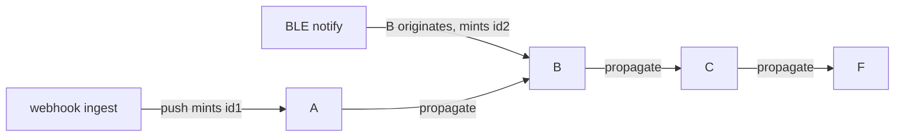

# RFC: In-Graph Origination (Source Actors)

> **Status: proposed.** Tracked in the [roadmap](../reference/roadmap.md#features)
> Features table until it lands. Realizes the *external-ingress → mint* row of the
> [observability](./observability.md) two-identities rule, and closes its
> no-run-sentinel follow-up.

## Concept

Let a **source actor** — a node that ingests external events (MQTT, webhook, BLE)
rather than receiving them via `push` — **originate a run** from inside the graph.
It gets a distinct **origination** capability (the dual of the host's `push`): it
**mints** a fresh correlation, opens a `run` trace root, and routes the event from
its out port. This is separate from continuation `emit`, which **propagates** the
in-scope correlation. A run can then begin either at `push` (host → graph) or at a
source node (`ble → B`), and each begins its own correlation and its own trace.

## Motivation

fuchsia is the engine under an IoT/automation hub, and some nodes are **sources**:
they subscribe to the outside world (an MQTT topic, a webhook, a BLE notify) and
turn events into graph work. Today they have no clean way to start a run:

- The only run trigger is `push` / `push_durable` (host → graph), which **mints** a
  correlation at the boundary. An actor's `emit_to` is a **continuation** — it
  propagates the in-scope correlation captured from `CorrelationId::current()`.
- A source actor emitting an external event has **no run in scope**, so
  `emit_to`'s `Delivery::new` falls to `CorrelationId::current().unwrap_or_default()`
  and **fabricates** a `cid-N` — the exact anti-pattern the
  [two-identities rule](./observability.md) names. The run "works," but on the
  fabrication path that rule wants to delete.
- So origination only happens by accident. The decision rule says *external ingress
  → mint*, but today **only the host (via `push`) can mint** — a node cannot.

What this unblocks: source-driver-as-node (`ble → B → C`) with honest per-run
correlation and its own trace, and the removal of the `unwrap_or_default`
fabrication — origination becomes the *explicit* mint, so a bare no-scope emit can
resolve to the `none` sentinel.

## Design

### Continuation vs. origination

Two semantically different emits; today's `emit` only expresses the first:

- **Continuation** — an actor mid-run emits onward (`B → C` within a run).
  **Propagates** the in-scope correlation. (Today's `emit_to`.)
- **Origination** — a source actor ingests an external event and emits it as the
  **start** of a new run. **Mints** a fresh correlation and opens a `run` root.

They differ on two independent axes — *who is targeted* and *which correlation* —
which is the cleanest way to see how `push`, `emit`, and origination relate:

| | **mint** a fresh correlation | **propagate** the in-scope one |
|---|---|---|
| **target = one entrypoint (by id)** | `push` / `push_durable` | (only a durable feeder re-delivering an existing run) |
| **target = the source's out-port successors** | **`originate`** (new) | `emit_to` (continuation) |

So `push` and `originate` both **mint** (they're triggers); `emit` **propagates**.
`push` targets a named entrypoint; `emit`/`originate` route from a node's out port.
**`originate` is the missing "successors + mint" cell** — which is why it *feels
like* "`push` from inside the graph," but (see Alternatives) it is a **sibling** of
`push` over a shared delivery kernel, not `emit` wrapping `push`.

### The flow scenarios



- A message entering at the webhook carries **`id1`** through `A → B → C → F`
  (minted at `push`, then propagated).
- A BLE event B ingests **originates** a new run **`id2`**, carried `B → C → F`
  (minted by `originate`, then propagated).
- The shared `B → C → F` edges carry **whichever run the message belongs to** — `C`
  and `F` handle messages from *both* runs, each message tagged with its own
  correlation. Two runs, two correlation ids, two `run` traces.

### The mechanism (it composes existing primitives)

fuchsia already has the parts; origination is a thin, explicit verb:

```rust
// what `originate("out", msg)` does, conceptually:
let id = CorrelationId::new();   // mint — this is a trigger
id.sync_scope(|| {               // scope the route so the deliveries capture `id`
  route(source, "out", msg);     // the existing emit fan-out, now under the new id
});
// + open the `run` root span (parent: None), as `push` does — optionally
//   follows_from an ingest span the host supplies for the device event.
```

`CorrelationId::sync_scope` exists for exactly this ("stamp a synchronous emit with
a specific run id"), so the runtime/engine work is wiring, not new machinery.

### Layer ownership

- `fuchsia-engine` — provides the **origination** capability (it already owns
  routing + correlation stamping via `RoutedEmit`; origination is its
  mint-and-route sibling) and opens the `run` root.
- `fuchsia-actor` — the capability bag carries it: a new capability type
  (e.g. `Origin`) **alongside** `Emit`, injected only into source actors. No
  guest-contract change for actors that never originate.
- The **host** owns the **policy**: which actors are sources, and *when* to
  originate (libra writes the BLE/MQTT source node and calls `originate`). fuchsia
  owns the **mechanism** (mint + route + root).

### Closes the no-run sentinel

With an explicit origination verb, a bare no-scope `emit` no longer needs
`unwrap_or_default` to cover "a source actor starting a run" — that case is now
`originate`. So `emit`'s no-run path can honestly resolve to the **`none`** sentinel
(the [observability](./observability.md) follow-up), and a fabricated correlation
can never appear.

## Alternatives considered

- **Make `emit` auto-mint when there's no correlation in scope.** Rejected — the
  fabrication trap: a no-scope emit might be a legitimate origination *or* a stray
  bug, and you can't tell, so you'd mint phantom runs. Origination must be
  **explicit**.
- **Route all `emit`s through `push`.** Rejected — `push` mints, so every hop would
  start a new run and `B → C` continuation would break.
- **`emit` wraps `push`.** Doesn't fit — they're **peers**, not layered. `push`
  targets one named entrypoint and *mints*; `emit` fans out to the source's
  successors and *propagates*. Wrapping `push` would (a) force a per-successor
  `push` (overloading `push`'s single-target shape) and (b) push its defining "I am
  a trigger, mint" meaning onto continuation. The honest factoring is the opposite:
  `push`, `emit`, and `originate` **share a lower kernel** — *offer a `Delivery`
  (carrying a correlation + span) to a target mailbox* — and compose it with the two
  independent choices in the 2×2 above. `originate` is the sibling that picks
  *successors + mint*.
- **Keep ingress host-side only (status quo).** The host's BLE/MQTT client calls
  `engine.push(&B, event, CorrelationId::new())` — already correct, no new
  mechanism. This stays the simplest path and the recommended one *when the driver
  can live host-side*. Origination is for when you genuinely want the **driver
  itself to be a node** (`ble → B` inside the graph) — a real want for a hub, but
  the heavier option.

## Open questions

- **Where the origination root links.** Should the `run` root `follows_from` a
  host-supplied ingest span (so a BLE/MQTT receive on the host links to the run it
  spawned), or be a clean root when the host has no trace context? (Leaning: link if
  the host supplies context, else a clean root — same as `push`.)
- **One capability or a method on `Emit`.** A distinct `Origin` capability injected
  only into sources (cleaner — "this node may start runs" is explicit in its
  wiring) vs. a second method on the existing emit capability (any actor *could*
  originate). Leaning distinct capability.
- **External / adopted ids.** Should `originate` allow adopting an external id (an
  MQTT message id, a device event id) instead of minting, exactly as `push` adopts
  an external request id? (Likely yes — same shape as `push`.)
- **Fan-in across runs.** `C` / `F` now handle interleaved messages from multiple
  runs (`id1` and `id2`). This already happens with multiple `push`es, so nothing
  new — but worth stating that a node's state must not assume a single run.

## Host vs. fuchsia boundary

- **fuchsia**: the `originate` mechanism (mint + route + `run` root) and the
  capability that carries it.
- **the host (libra)**: the device/transport subscription itself (the MQTT / BLE /
  webhook client), which nodes are sources, *when* to originate, and any external id
  to adopt.
