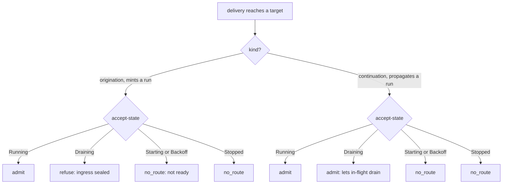
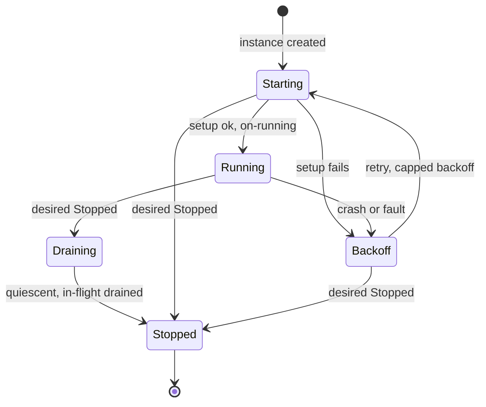
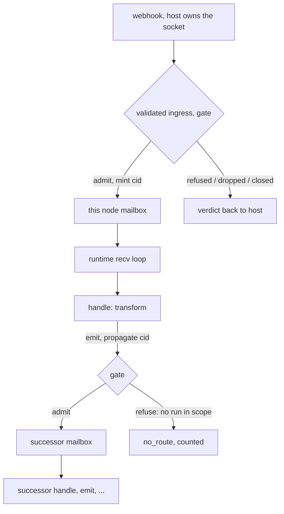
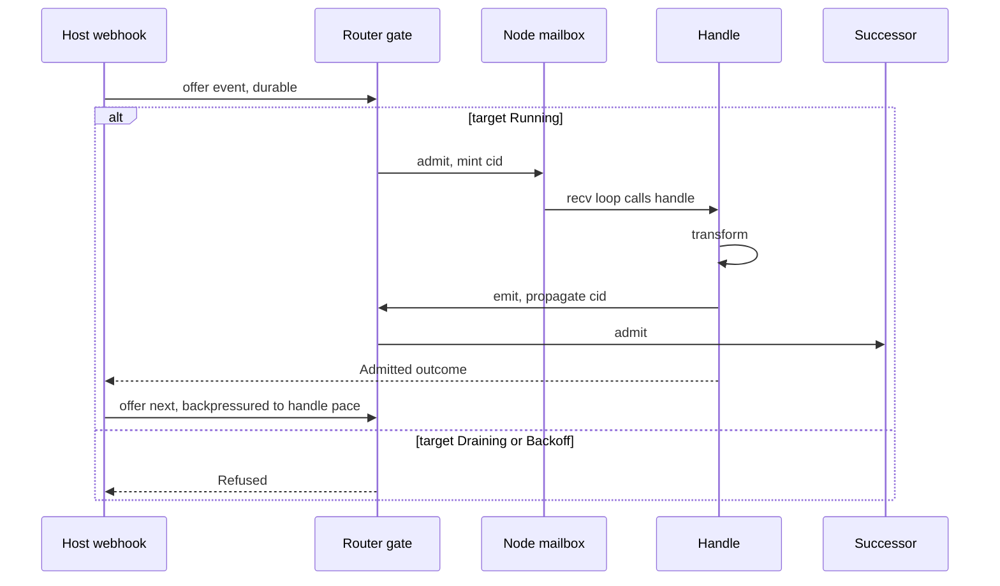
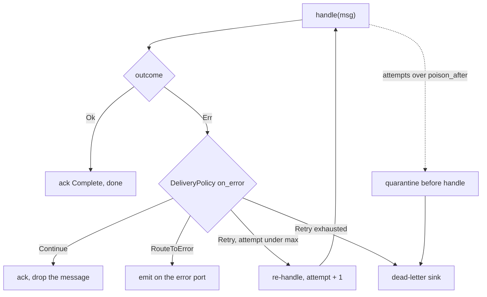

# RFC: Lifecycle-Gated Routing

> **Status: proposed.** Tracked in the [roadmap](../reference/roadmap.md#features)
> Features table until it lands. Generalizes
> [Graceful Shutdown](./graceful-shutdown.md)'s entrypoint *seal* and
> [Supervised Node Lifecycle](./supervised-bringup.md)'s *on-running seam* into one
> admission gate, realizes [Observability](./observability.md)'s mint/propagate
> rule as the gate predicate, and **supersedes**
> [In-Graph Origination](./in-graph-origination.md) (origination becomes a gated
> routing primitive). Builds on [DAG Enforcement](./dag-enforcement.md).

## Concept

Make **message admission** a property of the routing layer, gated on each target's
**lifecycle state** — not a privilege of a special front-door API. Every route
(`push`, `emit`, an in-graph `originate`, a source actor's subscription pump) is
admitted or refused by one check the router already makes on every hop: *given the
target's accept-state and whether this delivery **originates** a run or **continues**
one, may it land?*

That single gate does four things at once:

1. **Demotes `push`/`push_durable`** from a privileged ingress to one *caller* of a
   routing-owned **origination primitive** (mint a correlation + open the `run` root
   + offer). `emit`, `originate`, and a source pump are the other callers.
2. **Makes quiescence structural.** Set a node `Draining` and the gate refuses *new*
   runs while still admitting *in-flight continuations* — for `push` **and** for a
   self-originating tap, uniformly. A tap cannot feed a draining graph because its
   originations are refused at the router, not because we forbade it from existing.
3. **Makes in-graph origination safe**, which is why this supersedes that RFC: the
   hazard that argued *against* letting a node originate (a detached tap injecting
   into a draining graph) is closed by the gate, so origination is reinstated — as a
   gated primitive, not a special capability.
4. **Unifies two seams already in the design**: Graceful Shutdown's "seal the
   entrypoints" and Supervised Lifecycle's "not routable until `Running`" are both
   *this* gate, read at different points of the same per-node state machine.

## Motivation

Today `push` is special: it **mints** a correlation, **opens** the `run` trace root,
and **offers** to a mailbox — a privileged admission path no other emit has. That
specialness is the root of three otherwise-separate problems:

- **Shutdown ordering.** Graceful Shutdown seals `push`, but the recv loop only exits
  once a mailbox is closed *and drained*. A self-originating source (a node owning an
  MQTT/BLE subscription) keeps offering into mailboxes that are trying to drain, and
  it lives *outside* the supervised recv→handle loop — so "seal the front door" does
  nothing about it. Sealing the *wrong layer*.
- **In-graph origination looked unsafe.** Letting a node start a run from a detached
  subscription appeared to break quiescence — precisely *because* admission wasn't
  gated, so a tap could inject anywhere, anytime.
- **`emit` can't tell delivered from routed-nowhere** (a logged gap): `Emit::emit_to`
  returns `()`, so the router can't report refusal back.

A survey of sixteen actor, streaming, and automation systems
([see below](#what-the-survey-settled)) makes the resolution clear: **no mainstream
runtime forbids self-origination; the mature dataflow engines instead make admission
the engine's job.** Flink's FLIP-27 *removed* self-originating source threads for an
engine-driven pull model ("actor/mailbox/dispatcher style operator"); GenStage was
*built* with a producer/consumer split and demand-pull; Kafka Streams is pull-by-design
("does not use a backpressure mechanism because it does not need one"). And classic
Flow-Based Programming — the most rigorous treatment — shows self-origination and a
*provable drain* coexist when the runtime has **(a)** bounded backpressure and **(b)**
**port-closure propagation**: closing the upstream ports cascades downstream until the
network reaches quiescence.

**Lifecycle-gated routing is port-closure propagation, generalized.** The lifecycle
state is the port-open/closed bit; the router enforces it. We stop trying to fix
shutdown by restricting *who may originate* (the front-door idea) and instead gate
*where every delivery lands* — so a delivery's origin no longer matters to quiescence.

## Design

### 1. The delivery primitive: origination vs. continuation

There are exactly two kinds of admission, and the router owns both:

- **Origination** — *mint* a fresh `CorrelationId`, open the `run` trace root, and
  offer the delivery. Callers: the host's `push` / `push_durable`, and the
  **validated ingress** a source actor's `subscribe` wires up (the host feeds it).
- **Continuation** — *propagate* the in-scope correlation captured from
  `CorrelationId::current()`. Caller: `emit` / `emit_to`, **only from within a
  `handle`** — no run is in scope anywhere else.

`push` thus stops being special. It is "the host's caller of the origination
primitive"; a source actor's `subscribe` ingress is "another caller of the same
primitive." The actor itself never mints — it registers a `subscribe`, and the engine
originates when an event is admitted. The mint-and-root mechanism lives *in* routing,
where it can be gated, instead of in `push`'s public method.

> This is the [two-identities rule](./observability.md) made operational: *mint*
> (origination) vs *propagate* (continuation) was a tracing convention; here it
> becomes the predicate the gate branches on.

### 2. The gate: accept-state × kind

Every routable target carries an **accept-state**, read straight from the instance's
**actual** state ([Supervised Node Lifecycle](./supervised-bringup.md)) plus the
`Draining` transition ([Graceful Shutdown](./graceful-shutdown.md)). The router
consults it on **every** route — the same lookup that today returns
`(mailbox, health)` in `RouterState` now also reads an accept-state (an atomic enum
beside `Health`, so the check is a load on the hot path, not a new lookup).

Admission is a function of *accept-state × kind*:



The load-bearing cell is **Draining**: *refuse origination, admit continuation*. That
is what "seal the door, then drain" **is**, expressed once and applied to every
source — `push`, `emit`, a tap — instead of only to `push`.

This generalizes the two existing seams:

| Existing seam | What it gates | This gate |
|---|---|---|
| Supervised Lifecycle "on-running" | not `Running` ⇒ `no_route` | the `Starting`/`Backoff`/`Stopped` rows |
| Graceful Shutdown "seal entrypoints" | `push` stops at `Sealing` | the `Draining × origination` cell, for **all** sources |

### 3. The accept-state machine

The states are Supervised Lifecycle's instance actual-states, with `Draining` as the
graceful `Running → Stopped` transition:



| Accept-state | Origination | Continuation |
|---|---|---|
| `Starting` / `Backoff` | `no_route` (not yet routable) | `no_route` |
| `Running` | admit | admit |
| `Draining` | **refuse** (ingress sealed) | **admit** (drain in-flight) |
| `Stopped` | `no_route` | `no_route` |

**Why drain provably terminates.** Graphs are acyclic
([DAG Enforcement](./dag-enforcement.md)), so once a node is `Draining` and
origination is refused, the remaining in-flight work is a *finite* DAG traversal of
continuations — it cannot loop, so it drains in bounded time. The "is it drained yet"
signal is **not** new: it is Graceful Shutdown's **in-flight quiescence counter**
(increment on enqueue, decrement on handle-complete). `Draining → Stopped` fires when
that counter hits zero (or the deadline forces it). This RFC adds the *gate*; the
*counter* and the *topological teardown* stay where they are.

### 4. Message passing when a run originates from an actor

A **source actor** owns no loop. It **subscribes** in `setup` to a host capability
(the webhook / MQTT / BLE driver), which wires a **validated ingress** into this node's
mailbox: the host owns the socket, the engine validates each event against the
accept-state, and admitted events arrive at `handle` as gated originations. The node's
logic stays in `handle`, under the supervised recv→handle→ack machinery (retry,
poison-quarantine, dead-letter).

```rust
#[async_trait]
impl Actor for WebhookSource {
  async fn setup(&mut self, ctx: &ActorContext) -> Result<(), ActorError> {
    // Wire the validated ingress; events arrive at `handle`. The host owns the
    // socket -- no actor-side loop, no new capability. node_id targets the ingress.
    self.sub = Some(self.webhook.subscribe(ctx.node_id.clone()).await?);
    Ok(())
  }
  async fn handle(&mut self, _ctx: &ActorContext, msg: Message) -> Result<(), ActorError> {
    self.emit.emit(transform(msg)?);   // continuation: propagates this run's correlation
    Ok(())
  }
  async fn teardown(&mut self, _ctx: &ActorContext) -> Result<(), ActorError> {
    if let Some(sub) = self.sub.take() { sub.close().await; }  // graceful unsubscribe
    Ok(())
  }
}
```

`webhook` is an **open-bag host capability** — fuchsia never defines it — so a source
actor needs **no contract change**: `setup` / `handle` / `teardown` and `Emit` already
exist. The validated ingress hands the host an admission **verdict** per event:

```rust
enum Admission { Admitted, Refused, Dropped, Closed }
```

`Refused` is the accept-state gate saying no (`Backoff` / `Draining`); `Dropped` is a
full mailbox (fire-and-forget); `Closed` is the actor torn down. A **durable**
subscription acts on the verdict (return an error to the host / await room —
`push_durable` semantics); a **fire-and-forget** one sheds. This is Akka's
`Source.queue` `offer -> QueueOfferResult`, plus the one `Refused` variant the
lifecycle gate adds.

**Crash-safety.** `teardown` does *not* run on a panic-rebuild, so the subscription
unsubscribes on **`Drop`** — tying its lifetime to the instance, with `teardown`'s
`close()` as the graceful path. A `Backoff` instance leaks no tap.

The full path — the gate on both the ingress (origination) and the emit (continuation)
hop, with the host owning the I/O:



End to end, the durable variant — the host learns the outcome before offering the next
event (backpressure), and a non-`Running` target returns a verdict rather than silently
dropping:



`subscribe()` is `Source.queue` with a lifecycle check on the front: the host offers,
the gate validates, admitted events reach `handle`. The actor owns no loop, holds no
origination capability, and stays purely reactive — every event enters through the one
gated, runtime-owned admission point.

### 5. Does an actor retry? Yes — the delivery path is unchanged

Because the validated ingress *admits to the mailbox* and the logic lives in `handle`,
an originated message gets the full delivery policy — the answer to "does an actor
retry" is the same as for any other message:



Had the source emitted from a self-owned loop instead (the actix `add_stream` shape),
*none* of this would apply — a transform error would be an untracked failure off the
supervised loop. Admitting through the ingress into the mailbox is what buys retry,
poison-quarantine, and dead-lettering for free.

### 6. Layer ownership

- `fuchsia-transport` — the **accept-state** enum beside `Health`; the
  **origination/continuation marker** carried on `Delivery` (so the router branches
  without inferring).
- `fuchsia-engine` — the **gate** (`RouterState` reads accept-state on every route,
  applies the predicate, returns an **`Admission` verdict** — `Admitted` / `Refused` /
  `Dropped` / `Closed` — rather than today's `()`); the **origination primitive**
  (mint + `run` root + offer); `push`/`push_durable` reduced to callers of it; the
  `Draining` accept-state and the `Draining → Stopped` quiescence edge (over Graceful
  Shutdown's counter).
- `fuchsia-runtime` — already owns the actual-state transitions
  ([Supervised Lifecycle](./supervised-bringup.md)); makes `emit` with **no run in
  scope** a `no_route` (kills the `unwrap_or_default` fabrication and enforces
  *continuation only from a `handle`*).
- `fuchsia-actor` — **no new capability.** A source actor uses an *open-bag host
  capability* (`Webhook` / `Mqtt` / `Ble`, defined by the product) plus the existing
  `setup` / `handle` / `teardown` and `Emit`. The subscription handle unsubscribes on
  `Drop`, so a tap can't outlive its instance.
- **host** — owns the device/transport subscription and the socket itself, *whether* a
  node is a source, and the durable-vs-fire-and-forget choice; fuchsia owns the mint +
  route + gate mechanism and the `Admission` verdict it returns.

## What the survey settled

A sixteen-system survey (actor runtimes, streaming engines, and the n8n / Node-RED /
Home-Assistant / FBP product peers) backs the shape of this design:

- **No one enforces front-door-only.** Self-origination is the default (Erlang
  sockets, actix `add_stream`, n8n triggers, HA integrations, FBP generators).
- **The mature dataflow engines moved toward engine-mediated admission** — Flink
  FLIP-27 (removed self-originating source threads), GenStage (producer/consumer +
  demand), Kafka Streams / Spark (pull-by-design).
- **Everyone keeping self-origination pays for safe shutdown with ordered drain** —
  Flink `stop-with-savepoint --drain`, Akka `CoordinatedShutdown` phases, Broadway's
  terminator, Erlang/Ranch `suspend → drain → stop`, Beam drain, n8n
  stop-triggers-then-drain — *all six* stop ingress first, then drain.
- **The product peers prove the cost of *not* having this**: Node-RED abandons
  in-flight messages on redeploy (its maintainer calls graceful drain unbuilt future
  work); Home Assistant, the most disciplined, *still* has a documented shutdown race
  (#827) because admission is decentralized; n8n leaks listeners when a node's cleanup
  is wrong (#17795). Each is a symptom of *no central admission gate*.
- **FBP is the precedent for the mechanism**: bounded backpressure + port-closure
  propagation reconcile self-origination with a provable drain — which is what this
  gate, plus the acyclicity guarantee, delivers.

## Alternatives considered

- **Front-door-only (forbid in-graph origination).** The earlier lean: restrict *who*
  may originate so quiescence holds. Rejected — it treats the symptom. Gating
  admission gets the same quiescence *without* the restriction, and reinstates
  in-graph sources (a real want for an IoT hub).
- **Seal `push` only (Graceful Shutdown as-is).** Sufficient *until* a node can
  self-originate, then a tap walks straight past the seal. The gate is the
  generalization that keeps Graceful Shutdown correct once origination exists.
- **Actor-owned pump + an `Origin` capability.** An earlier shape: the source spawns a
  detached task in `setup` holding a gated `originate` capability and pumps events in.
  Rejected — it puts a detached task *and* mint authority inside the actor when the
  host already owns the socket. The **validated ingress** (`subscribe` → the host feeds
  an engine-gated channel) needs no actor loop and no new capability.
- **Emit-from-a-self-owned loop (the actix `add_stream` shape).** Puts logic in a
  detached loop that bypasses recv→handle→ack — no retry, no poison, no dead-letter,
  and `handle` left empty. Rejected in favor of *admit through the ingress to the
  mailbox, logic in `handle`*.
- **Auto-mint when no correlation is in scope.** The fabrication trap (a no-scope
  emit might be a real origination or a stray bug). Origination stays explicit — a
  distinct primitive — exactly as [In-Graph Origination](./in-graph-origination.md)
  argued.

## Resolved

- **Gate granularity → per-node.** The accept-state *is* Supervised Lifecycle's
  per-instance `Actual` state (no new state); the gate reads the target node's state on
  every route. Whole-graph operations compose over it — `remove_graph` sets
  `desired = Stopped` on every node in the group, and each node reconciles
  `Running → Draining → Stopped` on its own. "The graph is draining" is a *derived
  aggregate*, never stored. (This also hardens the `remove_graph` zombie race — a
  `Draining` / `Stopped` node's routes are sealed by its accept-state, so a late
  delivery can't land on a half-removed mailbox.)
- **Origination/continuation marker → on `Delivery`, stamped by the construction path,
  not the caller.** The kind is decided by *which internal builder* created the
  delivery: the **ingress path** (the engine draining a source's `rx`, or a host
  `push`) mints a correlation and stamps `Origination`; the **emit path** (`RoutedEmit`
  from inside a `handle`) propagates `current()` and stamps `Continuation` — or refuses
  if no run is in scope. Those paths already differ, so there is no new duplication and
  one gate reads one tag. The host/webhook and `emit` never name the kind.
- **`Draining` → a real state.** It joins Supervised Lifecycle's `Actual` enum
  (`Starting | Running | Draining | Backoff | Stopped`); the graceful edge becomes
  `Running → Draining → Stopped`, while crash (`Running → Backoff`) and bring-up
  (`Starting` / `Backoff → Stopped`) skip it — no running instance means nothing in
  flight to drain. The **supervisor** drives both edges (enter on `desired = Stopped`,
  with an entry action that signals the ingress to stop; exit when the in-flight counter
  hits zero or the teardown deadline fires); the gate only *reads*. This folds Graceful
  Shutdown's engine-level "Sealing/Draining" into the per-node state, consistent with
  per-node granularity above.
- **Full-mailbox overflow → the gate names it (`Admission::Dropped`); the *policy* is a
  follow-up RFC.** The lifecycle gate is *admission* (open/closed), not *flow control*
  (rate). A full-but-alive downstream is the `Dropped` verdict; *what to do* about it is
  a **per-edge overflow policy**: `Shed` (today's default — right for the conditioning
  operators that intentionally thin streams), `Backpressure` (the real want for workflow
  edges: suspend and throttle the source, which fuchsia's acyclic graph makes
  deadlock-safe — the same property that terminates drain, and what `push_durable`
  already does at the ingress), or `DeadLetter` (when the target is *gone*, or an opt-in
  lossy-but-observable edge). Deferred to its own RFC.

## Follow-ups

- **Per-edge overflow policy** — its own RFC. `Shed | Backpressure | DeadLetter` on a
  full downstream mailbox, extending `push_durable`'s blocking send to internal hops for
  the `Backpressure` case. Orthogonal to lifecycle admission (a flow-*rate* axis) but
  plugs into this RFC's `Admission::Dropped` verdict; supersedes the logged
  [routing-sheds-on-full gap](../reference/roadmap.md#gaps).

## Host vs. fuchsia boundary

- **fuchsia** owns the **mechanism**: the accept-state gate, the origination
  primitive (mint + `run` root + offer), the `Draining` transition and its quiescence
  edge, and signalling the ingress subscription to stop on the `Draining` edge.
- **the host** owns the **policy + I/O**: the device/transport subscription, which
  nodes are sources, when to set a node `Stopped` (driving `Draining`), and any
  external id an origination adopts. fuchsia never learns what a webhook, a device, or
  an entity is.
