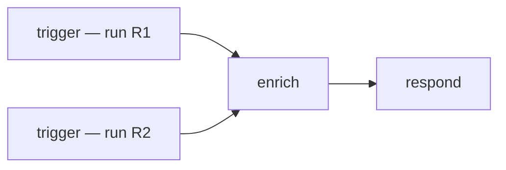
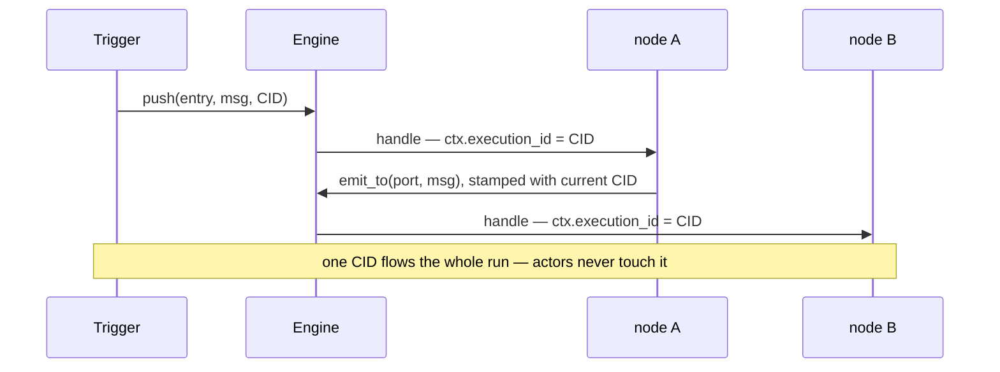

# RFC: Per-Message Correlation Id

> **Status: proposed.** Tracked in the [roadmap](../reference/roadmap.md#features)
> Features table until it lands.

## Concept

Stamp every message with a **correlation id** — minted once at the trigger that
starts a run, then carried unchanged through every `emit`/route hop and across the
guest boundary. It answers "which run / which originating event does this message
belong to?" so an error, a metric, or a final result can be tied back to the
request that caused it.

## Motivation

Identity is at the wrong granularity today. `ActorContext` is built **once per
actor at spawn** (`fuchsia-runtime`'s `Runtime::context`) with `execution_id =
node_id = task_id =` the actor's own id, and that *same* context is handed to every
`handle` call for the actor's life. So `execution_id` is a static per-actor label,
not a per-run id, and nothing mints or propagates a run id through the graph. The
WIT contract already *reserves the field* — `actor.wit`'s `context` record has
`execution-id`, `node-id`, `task-id` — it's simply never populated meaningfully.

(A `correlation_id` briefly existed on the payload — commit `4c00c4c` — and was
dropped in the handle-per-message rewrite. This RFC reintroduces it, but at the
right layer: propagated per-*delivery* metadata, not a field every actor must
remember to copy.)

Concretely, the gap bites when two runs share a node. Both flow through `enrich` and
`respond`, but each message's `ctx.execution_id` is just the node's own id — nothing
on the message says "this belongs to run R1, that one to R2":



So an error in `respond`, or its output, cannot be attributed to the run that caused
it. (The trace *span* is threaded per-message — but spans are for observability, not
routing; see Alternatives.)

Two planned features are blocked without it:

- [Node failure handling](./node-failure-handling.md) — an error must name *which
  run* failed so the right execution's error branch fires and the right caller is
  notified.
- [Runs & result correlation](./runs-and-results.md) — a synchronous trigger (an
  n8n webhook) must collect *its* run's terminal output and return it; that's
  correlation-keyed result collection.

## Design

**Carry it on the delivery, propagate it like the trace span.** The runtime already
threads one piece of per-message context automatically: `Delivery` captures
`Span::current()` so a trace follows a message across mailbox hops
(`fuchsia-transport`'s `delivery.rs`). Correlation id rides the exact same rails.



**`fuchsia-transport`.** Add the id next to the span on `Delivery`:

```rust
pub struct Delivery {
    pub msg: Message,
    pub ack: Ack,
    pub span: Span,
    pub correlation: CorrelationId,   // new
}
```

**`fuchsia-runtime`.** In `run_actor`, before calling `handle`, set the current
correlation (a task-local, mirroring how a `Span` is entered) and build a
**per-message** `ActorContext` from it — finally giving the three context fields
distinct meanings: `node_id` = the actor (static), `execution_id` = the run (from
the delivery), `task_id` = this handling (per-message). The context becoming
per-delivery rather than per-actor is the one real behavior change:

```rust
// today — one context per actor, reused for every message it handles
let ctx = ActorContext::new(id, id, id);   // execution_id == node_id == task_id

// proposed — a context per delivery, execution_id taken from the message
let ctx = ActorContext {
    node_id,                              // static: which actor
    execution_id: delivery.correlation,   // per run: which execution
    task_id: fresh_task_id(),             // per message: this handling
};
```

**`fuchsia-engine`.** `RoutedEmit::emit_to` stamps each outgoing `Delivery` with
the *current* correlation (read from the task-local set by `run_actor`), exactly as
`Delivery::new` already captures the current span. Actors and guests therefore
**never manage correlation themselves** — input-to-output propagation is automatic.
`Engine::push` takes the correlation id as a parameter — one entry point, no
footgun. The caller mints one with `CorrelationId::new()` when it has nothing to
correlate, or passes an existing id (an external request/trace id, or a parent
run's id) when it does:

```rust
pub fn push(&self, entrypoint: &ActorId, msg: Message, id: CorrelationId) -> Result<(), EngineError>;
```

Taking the id rather than minting-and-returning lets a trigger register its result
collector *before* the run starts (see [runs & result correlation](./runs-and-results.md)),
so a fast run can't finish before the caller is ready for it.

**`wit` (guests).** No signature change needed — `context.execution-id` already
exists; the host populates it per `handle` call from the current correlation, and
the host's `emit` impl stamps guest emissions from the same current value. A guest
reads `ctx.execution-id` if it wants the id; it never has to thread it.

**Id type.** An opaque newtype (`CorrelationId(Arc<str>)`, or a 128-bit id rendered
lazily) — cheap to clone on the hot path, displayable in traces. Decided in
implementation.

## Alternatives considered

- **Status quo — `execution_id` on a per-actor context.** Cannot vary per run; the
  field is effectively dead. Rejected — it's the thing we're fixing.
- **Put it only on `Message` and have actors copy it input → output.** Burdens
  every actor and every guest script with correctly forwarding the id; one
  forgetful node breaks correlation for the whole downstream. Automatic propagation
  by the runtime (task-local + emit stamping) is the robust choice. Rejected.
- **Reuse the trace span's id as the correlation id.** The plumbing is identical,
  but trace ids are an *observability* concern — spans may be disabled (no
  subscriber), sampled, or dropped — and overloading them for result/error routing
  couples correctness to tracing config. We *borrow the mechanism* (task-local
  capture, per-delivery field) but keep a distinct id. Rejected.

## Open questions

- **Sub-executions.** `push` takes the id (caller mints via `CorrelationId::new()`
  or passes an external/parent id). Open: when a node fans a run into N child runs,
  should those child ids link back to the parent (a causation chain), or stay flat?
- **Span ↔ correlation linkage.** Should the correlation id be attached to the
  trace span as a field automatically, so traces and correlation cross-reference
  without double bookkeeping?
- **Ordering vs identity.** Correlation answers *which run*; it does not order
  messages within a run. Per-run ordering, if ever needed, is a separate concern.
