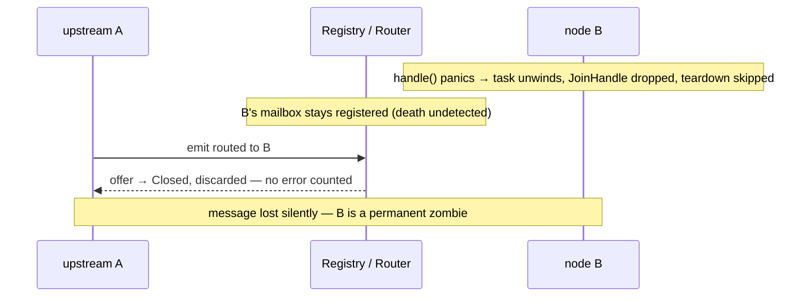
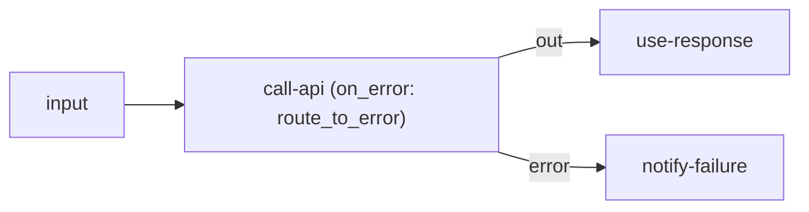

# RFC: Node Failure Handling

> **Status: proposed.** The death-detection part is a correctness fix that can land
> first. Tracked in the [roadmap](../reference/roadmap.md#features) Features table
> and the `fuchsia-runtime` Gaps table.

## Concept

A coherent story for "what happens when a node fails," spanning three failure
modes — a `handle` that returns `Err`, a `handle` that *panics*, and a message that
can't be processed — with author-chosen policy (fail / continue / retry /
route-to-error), a first-class **error output port**, a dead-letter sink, and
runtime **death detection** so a crashed node never silently disappears.

## Motivation

Failure is under-handled today:

- `handle` returns `Err` → the outcome is folded into a `Health` counter
  (`fuchsia-transport`'s `delivery.rs`) and the message is **dropped**. No retry, no
  error branch, no dead-letter.
- `handle` **panics** → the actor's task unwinds, but the `JoinHandle` is discarded
  at spawn (`fuchsia-runtime`'s `runtime.rs`), so the panic is swallowed,
  `teardown` never runs, and the registry/router **still hold the actor's
  mailbox**. The node becomes a zombie: still addressable, permanently dead, every
  routed delivery silently shed (`router.rs` discards the `Offer::Closed`). For a
  system whose pitch is "a stalled pipeline shows up as a rising error count rather
  than a silently frozen value," an actor *death* is exactly the unobservable
  failure the design claims to prevent.



Workflow products (n8n's "continue on fail" / error workflows; HA automations that
must not silently stop) need explicit, per-node failure semantics — and need to
*know* when a node dies.

## Design

Four parts, landable in order.

**1. Death detection (`fuchsia-runtime`) — the correctness fix, no dependencies.**
Keep the `JoinHandle` from `tokio::spawn(run_actor(...))`. Treat task exit (normal,
error, or panic) as a lifecycle event: deregister the actor so it stops resolving
as a routable target, and record it on `Health` as a distinct *death*, not just an
errored message. Optionally surface a death signal (a callback / watch channel) so
a supervisor or product layer can react. This alone closes the zombie gap and makes
node death observable.

**2. Per-node error policy (`fuchsia-actor` config + `fuchsia-runtime` loop).** An
author sets a policy in `settings`/config, applied by the run loop around `handle`:

- `fail` — on `Err`, stop the actor (run `teardown`, deregister). Fail-fast nodes.
- `continue` — drop + count (today's behavior). The default for lossy/conditioning
  paths.
- `retry { max, backoff }` — re-invoke `handle` with backoff before giving up.
  Distinct from the existing at-least-once *delivery* retry: `Ack::Complete`'s
  dropped-sender retry covers *lost deliveries*; this covers a *handler that
  errored on a delivered message*.
- `route_to_error` — emit the failed message + error metadata on the error port
  (part 3).

**3. Error output port (depends on [output ports](./output-ports.md)).** On a
handled `Err` under `route_to_error`, the runtime emits an error envelope on the
actor's reserved `"error"` port. A flow wires that port to an error-handling
sub-graph (n8n's error workflow). Because it's just another named output, this
falls out of the ports RFC at almost no extra cost.



A node's failure policy lives in its `settings`, and the error branch is wired like
any other port (see [output ports](./output-ports.md)):

```json
{
  "nodes": [
    { "id": "call-api", "type": "lua",
      "settings": { "script": "http-post", "on_error": { "policy": "retry", "max": 3, "backoff_ms": 500 } } }
  ],
  "edges": [
    { "from": "call-api", "from_port": "out",   "to": "use-response" },
    { "from": "call-api", "from_port": "error", "to": "notify-failure" }
  ]
}
```

When the `retry` budget is exhausted the failed message goes out the `error` port
(or to the dead-letter sink if nothing is wired).

**4. Dead-letter sink.** Messages that exhaust `retry` (or hit `fail`) with nowhere
else to go are offered to a host-provided dead-letter capability (a sink in the
bag), keyed by [correlation id](./message-correlation-id.md), so they're
inspectable/replayable rather than lost.

Every error path carries the [correlation id](./message-correlation-id.md) so the
*right run's* error branch fires and the right caller is notified.

## Alternatives considered

- **Status quo (count-and-drop + swallowed panics).** Simple, but the zombie is a
  real bug and workflows can't express error branches. Rejected.
- **Full Erlang-style supervision trees (links, monitors, restart strategies).**
  Powerful but heavy, and at odds with the dataflow model — nodes don't supervise
  each other; the *graph* owns topology. We take "supervision-lite": detect death,
  surface it, optionally restart-with-fresh-state at the engine/host layer, not a
  parent/child actor hierarchy. Rejected as core.
- **Catch panics with `catch_unwind` inside `handle`.** Brittle (unwind-safety of
  `&mut self`, poisoned state after a partial mutation); cleaner to let the task die
  and detect it (part 1) than to resume a panicked actor in place. Rejected.

## Open questions

- **Restart policy.** When a node dies, does the engine restart it (fresh state)
  automatically, with what backoff/limit, and does in-flight mailbox content
  survive? (Restart needs state to be disposable or checkpointed.)
- **Where the policy lives.** A field on `ActorConfig`, a per-edge attribute, or a
  graph-level default with per-node override?
- **Poison messages.** A message that deterministically panics every retry — should
  the dead-letter path trigger automatically after N deaths attributable to the
  same input?
