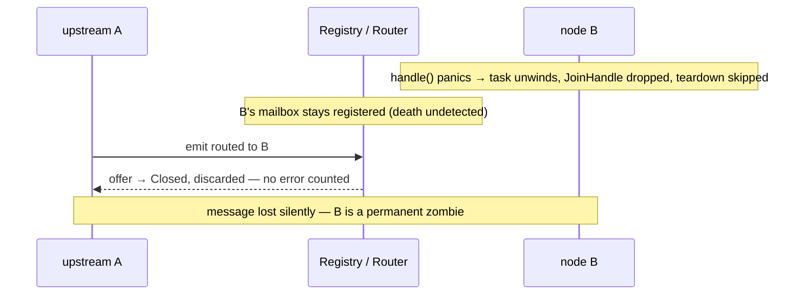
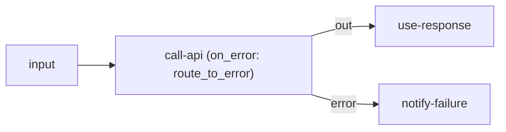

# RFC: Node Failure Handling

> **Status: in progress — parts 1–2 (death detection + error policy) shipped.** The
> three open questions are resolved (see [Decisions](#decisions)). Part 1: the runtime
> keeps the actor task's `JoinHandle`, a per-node supervisor deregisters a dead node so
> it stops resolving, records a distinct `Health::died` count, and surfaces a death
> callback the engine reacts to. Part 2: a typed, host-understood `FailurePolicy` on
> `ActorConfig` (continue / fail / retry-with-backoff), applied by the run loop around
> `handle` — `fail` reuses the part-1 death path; an exhausted `retry` currently falls
> back to count-and-drop until the dead-letter sink (part 4) lands. Parts 3–4 (error
> port, dead-letter) and restart/poison are pending. Tracked in the
> [roadmap](../reference/roadmap.md#features) Features table.

## Concept

A coherent story for "what happens when a node fails," spanning three failure
modes — a `handle` that returns `Err`, a `handle` that *panics*, and a message that
can't be processed — with author-chosen policy (fail / continue / retry /
route-to-error), a first-class **error output port**, a dead-letter sink, and
runtime **death detection** so a crashed node never silently disappears.

## Motivation

Failure is under-handled today:

- `handle` returns `Err` → the outcome is folded into a `Health` counter
  (`fuchsia-transport`'s `delivery.rs`) and the message is **dropped**. No retry, no
  error branch, no dead-letter.
- `handle` **panics** → the actor's task unwinds, but the `JoinHandle` is discarded
  at spawn (`fuchsia-runtime`'s `runtime.rs`), so the panic is swallowed,
  `teardown` never runs, and the registry/router **still hold the actor's
  mailbox**. The node becomes a zombie: still addressable, permanently dead, every
  routed delivery silently shed (`router.rs` discards the `Offer::Closed`). For a
  system whose pitch is "a stalled pipeline shows up as a rising error count rather
  than a silently frozen value," an actor *death* is exactly the unobservable
  failure the design claims to prevent.



Workflow products (n8n's "continue on fail" / error workflows; HA automations that
must not silently stop) need explicit, per-node failure semantics — and need to
*know* when a node dies.

## Design

Four parts, landable in order.

**1. Death detection (`fuchsia-runtime`) — the correctness fix, no dependencies.**
Keep the `JoinHandle` from `tokio::spawn(run_actor(...))`. Treat task exit (normal,
error, or panic) as a lifecycle event: deregister the actor so it stops resolving
as a routable target, and record it on `Health` as a distinct *death*, not just an
errored message. Optionally surface a death signal (a callback / watch channel) so
a supervisor or product layer can react. This alone closes the zombie gap and makes
node death observable.

This is also the seam restart hangs off: keeping the `JoinHandle` turns the
per-node task into a **supervisor** that owns the actor's `MailboxRx`, its
construction recipe, and the handle. Death stops being terminal — the supervisor can
rebuild the actor on the *same* mailbox (restart) instead of only deregistering it.
See [Decisions](#decisions).

**2. Per-node error policy (`fuchsia-actor` config + `fuchsia-runtime` loop).** An
author sets a policy on the node's config — a typed, **host-understood** field on
`ActorConfig` (not guest-opaque `settings`, since the runtime is its consumer; see
[Decisions](#decisions)) — applied by the run loop around `handle`:

- `fail` — on `Err`, stop the actor (run `teardown`, deregister). Fail-fast nodes.
- `continue` — drop + count (today's behavior). The default for lossy/conditioning
  paths.
- `retry { max, backoff }` — re-invoke `handle` with backoff before giving up.
  Distinct from the existing at-least-once *delivery* retry: `Ack::Complete`'s
  dropped-sender retry covers *lost deliveries*; this covers a *handler that
  errored on a delivered message*.
- `route_to_error` — emit the failed message + error metadata on the error port
  (part 3).

**3. Error output port (depends on [output ports](./output-ports.md)).** On a
handled `Err` under `route_to_error`, the runtime emits an error envelope on the
actor's reserved `"error"` port. A flow wires that port to an error-handling
sub-graph (n8n's error workflow). Because it's just another named output, this
falls out of the ports RFC at almost no extra cost.



In an **illustrative product schema** the failure policy sits beside the node's
other config and the error branch is wired like any other port (see
[output ports](./output-ports.md)); a product translates this `on_error` block into
the node's typed `ActorConfig.failure` field when it calls `add_node`
(see [Decisions](#decisions)):

```json
{
  "nodes": [
    { "id": "call-api", "type": "lua",
      "settings": { "script": "http-post" },
      "on_error": { "policy": "retry", "max": 3, "backoff_ms": 500 } }
  ],
  "edges": [
    { "from": "call-api", "from_port": "out",   "to": "use-response" },
    { "from": "call-api", "from_port": "error", "to": "notify-failure" }
  ]
}
```

When the `retry` budget is exhausted the failed message goes out the `error` port
(or to the dead-letter sink if nothing is wired).

**4. Dead-letter sink.** Messages that exhaust `retry` (or hit `fail`), and
**poison messages** that cross the per-delivery attempt threshold (see
[Decisions](#decisions)), with nowhere else to go are offered to a host-provided
dead-letter capability (a sink in the bag), keyed by
[correlation id](./message-correlation-id.md), so they're inspectable/replayable
rather than lost. Fuchsia owns the *seam*; the product owns *where* dead letters are
stored.

Every error path carries the [correlation id](./message-correlation-id.md) so the
*right run's* error branch fires and the right caller is notified.

## Alternatives considered

- **Status quo (count-and-drop + swallowed panics).** Simple, but the zombie is a
  real bug and workflows can't express error branches. Rejected.
- **Full Erlang-style supervision trees (links, monitors, restart strategies).**
  Powerful but heavy, and at odds with the dataflow model — nodes don't supervise
  each other; the *graph* owns topology. We take "supervision-lite": detect death,
  surface it, optionally restart-with-fresh-state at the engine/host layer, not a
  parent/child actor hierarchy. Rejected as core.
- **Catch panics with `catch_unwind` to *resume a panicked actor in place*.** Brittle
  (unwind-safety of `&mut self`, poisoned state after a partial mutation). Rejected
  *for in-place resume*. Note this does **not** reject catching to *discard and
  rebuild* the actor — there the instance is thrown away, so the poisoned-state
  objection doesn't apply; that variant stays live as panic-isolation option (a)
  under [Decisions](#decisions).

## Decisions

The three open questions are resolved as follows; the parts above are amended to
match. Two new public surfaces fall out — a `RestartPolicy` on the per-node config
and an `Engine::restart_node` — plus one new transport field, a per-delivery attempt
counter.

### Restart policy — per node, engine-coordinated, mailbox survives

When a node dies (part 1) the **engine restarts it with fresh state**, bounded by a
per-node policy:

```rust
// fuchsia-actor — host-understood, alongside the error policy (see below)
struct RestartPolicy {
    max_restarts: u32,    // 0 = never restart; default a small N
    backoff: Backoff,     // exponential: initial, multiplier, cap
}
```

- **Who owns what.** The *mechanism* lives in `fuchsia-runtime`: the per-node task
  from part 1 becomes a **supervisor** that owns the `MailboxRx`, the actor's
  construction recipe (the creator + `ActorConfig` + the capability bag), and the
  `JoinHandle`. On an abnormal exit it waits the backoff, rebuilds the actor instance
  (a fresh `&mut self`, fresh `setup`), and resumes the loop. `fuchsia-engine` owns
  the *public face* — it coordinates topology and exposes the restart surface — so
  "the engine restarts the node" from a consumer's view, delegating the rebuild to
  the runtime supervisor.
- **The mailbox survives.** The mailbox channel is owned by the supervisor, **not**
  the actor incarnation, so it outlives any one death: queued deliveries are retained
  and the rebuilt actor drains the *same* `rx`. Because the mailbox is stable, the
  router entry stays valid across a transient restart — routing is **uninterrupted**;
  upstream emits keep landing and simply queue while the actor is rebuilt. The granted
  capabilities survive too: `emit` (`RoutedEmit { source: id }`) is keyed on the
  stable node id, and `schedule` (`TokioSchedule`) holds a *weak* handle to the
  surviving mailbox — so the same capability bag is re-offered to each incarnation,
  no rebuild needed.
- **Only the in-flight message is at risk.** A returned `Err` leaves the failing
  message *in hand*, so it follows the error policy (retry / route-to-error /
  dead-letter). A *panic* unwinds it off the handler's stack, but the supervisor
  still knows which delivery it dispatched (it owns `rx`), so it reports a
  death-attributed failure (the `Ack` drops — `Complete` retries, `Health` counts)
  and treats that delivery as a poison candidate (below). Surviving the panic
  *without* losing the queue — cheaply — is a real, still-open implementation choice:
  the *outcome* is settled, the *mechanism* is not. See **Panic isolation** below.
- **Permanent death.** When `max_restarts` is exhausted the supervisor *deregisters*
  the node from the router (it stops resolving — death now reads as `no-route`/shed on
  upstream emits, per part 1), drains any remaining mailbox content to the dead-letter
  sink, and records the death on `Health`.
- **Panic isolation (open, and perf-sensitive).** The *outcome* — a panic loses
  neither the queue nor its attribution — is settled; the *mechanism* is chosen and
  benched when the supervisor lands (`fuchsia-runtime` carries criterion benches and
  the runtime is tuned for near-zero per-message cost, so the mechanism is picked on
  that axis). Three shapes: **(a)** wrap `handle` in `catch_unwind`
  (`AssertUnwindSafe`) and on a caught panic *discard and rebuild* the actor — the
  fresh instance neutralizes the poisoned-state objection that rejects `catch_unwind`
  for in-place *resume* (see [Alternatives](#alternatives-considered)); zero extra
  per-message cost, `rx` never leaves the supervisor. **(b)** Run the actor in a
  long-lived child task fed by the supervisor, so a panic aborts only the child while
  `rx` and the backlog stay in the parent — robust, but a channel hop per message.
  **(c)** Conservative fallback: keep queue-survival on the `Err` path only (free) and
  treat a *panic* as a hard node death that drops its queue — weakest (no panic-poison
  attribution) but simplest. The trade is robustness vs. per-message cost; (a) is the
  likely default.

**Forcing a restart from outside — `Engine::restart_node`.** A limit means the
runtime eventually *stops* restarting, so the outside world needs a way back in:

```rust
pub async fn restart_node(&self, id: &ActorId, force: bool) -> Result<(), EngineError>;
```

- By default it restarts only a node the router shows as **dead** (budget exhausted);
  asking to restart a live node is rejected as already-running (the runtime already
  has a `RuntimeError::AlreadyRunning`, surfaced through `EngineError`).
- `force: true` also restarts a **live** node: the current incarnation is torn down
  (`teardown`) and rebuilt with fresh state, the mailbox surviving as in any restart.
- A manual restart **resets** the backoff/limit budget — an operator's deliberate
  "try again," distinct from the automatic budget.

### Where the policy lives — a typed `ActorConfig` field, per node; no engine graph-default

Both the error policy (part 2) and the restart policy are **per-node and
host-understood**, so they ride a typed field on `ActorConfig` (in `fuchsia-actor`) —
*not* `settings`, which is opaque to the host and read only by the actor. The runtime
supervisor is the consumer, so it must be able to read the policy:

```rust
struct ActorConfig {
    env: BTreeMap<String, String>,
    settings: Document,
    failure: FailurePolicy,   // new: { on_error, restart, poison_after }; host-understood, with a sensible Default
}
```

There is **no engine-level graph default.** `fuchsia-engine` has no "graph" object —
only a *group* embedded in an `ActorId` and `remove_graph(group)`; topology and
authoring live in the *product's* schema above the engine (the standing "the
serialized graph is a product concern" line from [output ports](./output-ports.md)).
So a product that wants "every node in this workflow retries 3×" applies that default
**when it translates its workflow into `add_node` calls** — stamping each node's
`ActorConfig.failure`. That matches duplicating the policy per node, and keeps
graph-scoped config out of the engine, which holds no information to anchor it. A
graph-default surface can be added later *above* the engine if a product needs one; it
is not a runtime/engine concern.

### Poison messages — quarantine, don't loop

A **poison message** deterministically fails (`Err`) or panics the node every time —
so retrying it, or restarting and re-feeding it, just fails again. Unhandled, it
either loops forever (unbounded restart) or burns the node's whole restart budget,
killing it permanently. The mailbox surviving restarts (above) makes this *worse*
without a quarantine: a poison message at the head of a surviving queue would re-kill
every fresh incarnation.

Fuchsia **quarantines** it. The mechanism rests on *attribution* — telling "a sick
node" (dies on varied inputs) apart from "a bad message" (the same input kills every
incarnation):

- **Per-delivery attempt counter.** `Delivery` gains a small `attempts: u32`
  (`fuchsia-transport`), incremented each time the *same* delivery is re-handled (an
  error retry, or a re-feed after a death). It rides beside the existing
  `correlation` / `span` metadata.
- **Threshold → quarantine, not retry.** A `poison_after: N` on the failure policy:
  once a delivery's `attempts` reaches `N` it is classified poison and **diverted
  instead of retried**. Crucially, a poison message does **not** consume the node's
  *restart* budget — the fault is the input, so the node is spared and keeps serving
  other traffic; only deaths spread across *different* deliveries read as a sick node.
- **Where a quarantined message goes (in precedence).** (1) the reserved `"error"`
  port if wired (part 3 — into an error sub-graph); else (2) the host-provided
  **dead-letter sink** — a capability in the bag (like `emit` / `schedule`, but
  inserted by the *product* under its own trait), handed the message + correlation id
  + attempt count + the error/panic reason + originating node id; else (3) counted on
  `Health` as a distinct *dead-lettered* outcome and dropped. Never silent.
- **Fuchsia owns the seam, the product owns the store.** Fuchsia owns *detection*
  (attribution + threshold) and the *diversion* (error port → dead-letter capability →
  observable drop). **Where dead letters are stored is the product's choice** — a DB
  table, a Kafka/SQS DLQ, an n8n error-execution record, an HA log + notification, or
  nothing — precisely because upstream applications differ. It is the same shape as
  every other domain capability: fuchsia ships the trait seam, the product inserts the
  implementation.

This lines up with the durable path: `Engine::push_durable` already documents a
persistently-failing message as "a poison candidate the caller may dead-letter" — the
durable *feeder* counts its own retries and dead-letters on its side; the in-runtime
counter here covers the *internal-routing* retries the feeder can't see.

> **Detecting a panic-poison depends on the supervisor.** Attributing a *panic* (not
> just an `Err`) to its triggering delivery requires the supervisor to own `rx` and
> know the in-flight message across the unwind — the same architecture
> restart-with-mailbox-survival needs. The two reinforce each other; neither works in
> today's single-task, moved-in-`rx` model.

### Still open

- **Attempt-counter durability.** `attempts` on an in-memory `Delivery` resets if the
  process restarts; a durable mailbox would need the count to persist. Left to the
  durability layer the transport explicitly is *not* (the mailbox is in-memory today).
- **Backoff / limit defaults.** The exact default `max_restarts`, `poison_after`, and
  backoff curve — conservative starting numbers, tunable per node — settle when the
  supervisor lands.
- **Death / restart event stream.** Part 1's optional death signal (callback / watch
  channel) versus polling liveness off the router: an observability decision,
  deferred. `restart_node` needs only the router's liveness, which death detection
  already maintains.
