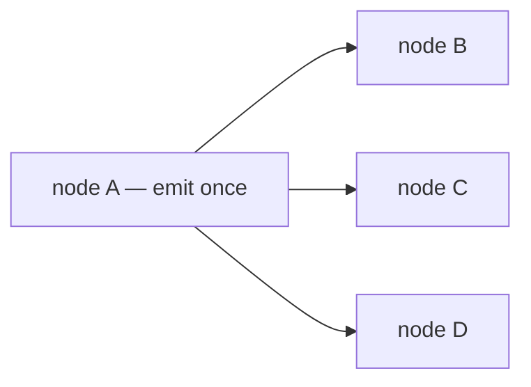
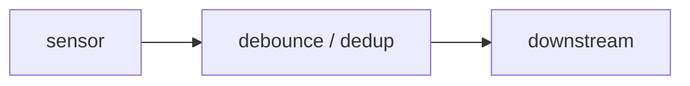
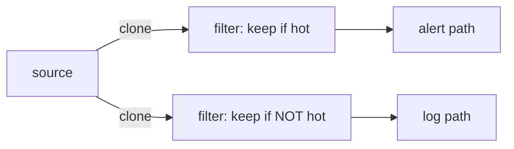
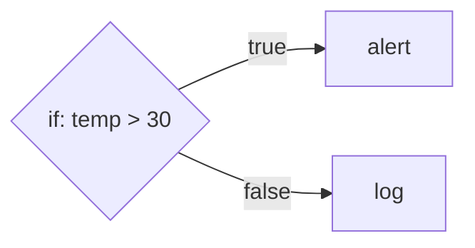
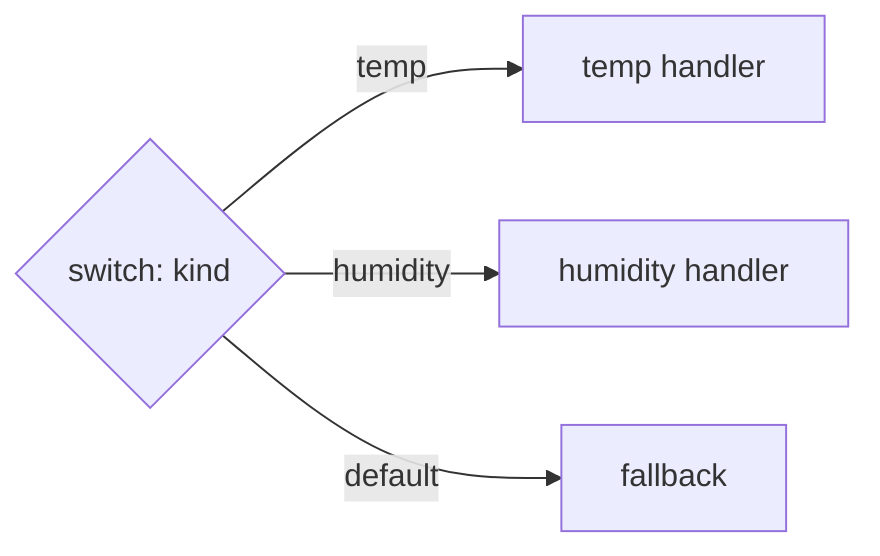
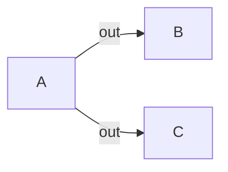
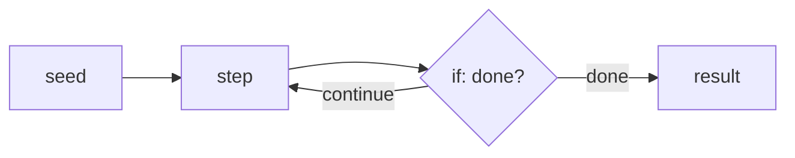
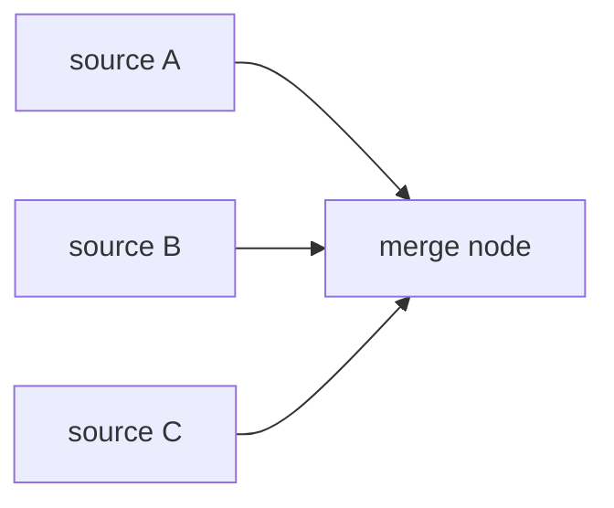

# RFC: Named Output Ports

> **Status: proposed.** Tracked in the [roadmap](../reference/roadmap.md#features)
> Features table until it lands.

## Concept

Give every actor more than one logical output. An actor emits to a **named port**
(`"out"` by default, but also `"true"`/`"false"`, `"case-a"`, `"error"`, …); the
graph connects `(source, port)` to targets; routing delivers an emission only to
the successors wired to the port it was emitted on. A port is part of the *node's
interface*, not the topology — the node chooses which of its own outputs to use,
and the graph still decides which actor each output reaches. The neighbor-ignorance
principle holds: a node names a port, never a peer.

## What we have today

Routing is **static fan-out**. An actor has exactly one output: its single `emit`,
which the engine clones to *every* successor (`fuchsia-engine`'s `router.rs::route`
loops all edges; the WIT `emit.send` doc literally says it "fans out the payload
across all outgoing edges").



Every emission reaches B *and* C *and* D. That is the *only* shape the engine can
express. There is no way for A to say "this one goes to B, that one goes to C" —
the node cannot select an output, because it only has one.

## Why conditioning operators don't solve branching

It is tempting to think you can bridge two nodes with a `debounce` or `dedup` to
get conditional flow. You can't — those are **unary** operators: one input, one
output. They decide *whether* a message passes (suppress a duplicate, rate-limit,
ignore a sub-threshold change), never *where* it goes.



A `debounce` on the edge A→B gates that one edge; it has nowhere else to send. So
to fake an IF you fall back to a **filter actor per branch** — every branch gets a
copy and re-checks a predicate:



This is the tax: O(branches) clones and predicate evaluations on every message; no
first-match and no clean default; and the author must hand-maintain that the branch
predicates are mutually exclusive (get it wrong and a message goes both ways, or
nowhere). For an n8n-/HA-style orchestrator where branching is in nearly every
flow, that's untenable.

The fix is not a smarter operator — it's giving a node **more than one output**.

(To be clear, conditioning operators stay useful: `debounce`/`deadband`/`dedup` are
genuinely one-in/one-out and bridging an edge with them remains the right model.
Ports address the *branching* shape, which is a different thing.)

## Design

**`fuchsia-actor` (contract).** Extend the `Emit` capability with a port-addressed
send; keep the existing single-arg form as the default port so current actors are
unchanged:

```rust
pub trait Emit: Send + Sync {
    fn emit_to(&self, port: &str, msg: Message);
    /// Convenience: emit on the default `"out"` port.
    fn emit(&self, msg: Message) {
        self.emit_to("out", msg);
    }
}
```

**`fuchsia-engine` (router).** Key edges by `(source, port)` instead of `source`:

```rust
// was: edges: HashMap<ActorId, Vec<ActorId>>
edges: HashMap<(ActorId, Port), Vec<ActorId>>,   // Port = String (or Arc<str>)
```

`add_edge` gains a port (`add_edge(from, "true", to)`); `route(source, port, msg)`
looks up `(source, port)`'s successors and offers to each — a port may still have
*multiple* successors, so fan-out *within* a port is preserved. `RoutedEmit`
implements `emit_to` by passing its `source` plus the port into `route`.
`remove_graph(group)` still removes by source group, so teardown is unaffected.

**`wit` (guest contract).** `emit.wit` gains the port, additively:

```wit
/// Send a typed payload on a named output port. `out` is the default.
send-to: func(port: string, msg: payload) -> result<_, string>;
send:    func(msg: payload) -> result<_, string>;   // = send-to("out", msg)
```

The host's `emit` implementation maps `send-to` onto `emit_to`. Existing components
that only call `send` keep working on the default port.

**`fuchsia-actor-builtins`.** The first port-using nodes ship here: a generic `if`
builtin (a predicate over the payload → `"true"`/`"false"`) and a generic `switch`
builtin (a key extractor → one of several named case ports, falling back to
`"default"`). These are *node types* — registered once under `"if"`/`"switch"` —
not bespoke actors.

### Where the predicate lives (it's configuration)

`temp > 30` is **not** coded into an actor. It lives in the `if` node *instance's*
`settings` — the opaque `bson` document every node carries — exactly the way
`debounce` reads `{ "delay_ms": 500 }` from its settings (`DebounceConfig`,
deserialized via the builtins' `from_settings` helper). The actor *code* is a
generic evaluator written once; each *use* in a graph is a configured instance. An
author drops an `if` node into the graph, fills in its condition, and wires its
`true`/`false` ports — no code:

```json
// node: { "type": "if", "settings": <below> }, with true/false wired downstream
{ "field": "temp", "op": "gt", "value": 30 }
```

The open decision is **how expressive that config is** — a spectrum, not a binary:

- **Declarative conditions (recommended default).** A small schema the `if`/`switch`
  builtins interpret: `field` / `op` / `value`, combinable with `all`/`any` groups.
  Pure data, no embedded language. Covers the overwhelming majority — it is exactly
  n8n's IF condition rows and Home Assistant's `numeric_state`/`state` conditions.
- **An expression string (optional middle tier).** `{ "expr": "temp > 30" }`,
  evaluated by an embedded mini-language (JSONLogic, CEL, or a crate like
  `evalexpr`). Still configuration — a string — with more power, but it brings an
  evaluator and a syntax to learn. A later addition if declarative conditions prove
  too limiting.
- **A script node (the escape hatch).** When logic is genuinely arbitrary, the
  author uses a Lua/JS node that calls `emit_to("true"/"false", …)` itself. Logic as
  code, *by choice* — not the default path.

The runtime already supports all three (settings-driven builtins + script actors);
the choice is only which the *first-party* `if`/`switch` ship with. This RFC
proposes the **declarative** default with the script node as the escape hatch, and
defers the expression tier.

### What configures a node's ports

A port is **not a node** — it is a named output *on* a node, part of the node's
interface. Two things are easy to conflate:

- **Which ports a node has** comes from the node's *type + config*:
  - *Fixed by the type* — `if` always has `true`/`false`; a `passthrough` has
    `out`. Baked into the generic evaluator; not configurable.
  - *Derived from config* — a `switch`'s ports are its configured cases plus
    `default`. Listing the cases in `settings` *is* configuring its ports:
    `{ "key": "kind", "cases": ["temp", "humidity"] }` → ports `temp`, `humidity`,
    `default`.
  - *Author-defined* — a Lua/JS node has whatever ports its script emits on via
    `emit_to(...)`; the author may also declare them in `settings` purely so an
    editor can draw them.
- **What each port connects to** is the *edge*. An edge names the source port it
  leaves from — `add_edge(from, "true", to)`; an omitted port means `"out"`. Port
  *selection* happens at the source end of an edge; the node never names a peer.

The engine needs no port *declaration* to run: routing is a `(node, port) →
successors` lookup, and emitting on an unwired port is a no-op. A declaration — a
node type advertising its ports, computed from type + config — is only for
**authoring/validation**, so a graph editor can render the outputs and reject an
edge from a port that doesn't exist (the "port declaration / validation" open
question below).

The serialized graph that carries these edges (with their `from_port`) is a
*product* concern: `fuchsia-engine` exposes only `add_node` /
`add_edge(from, port, to)`; a product's workflow schema and its translation into
those calls live above the runtime.

### Worked example

A reading flows in, an `if` checks it, and the two branches go to different nodes.
Here is the author-facing graph — an **illustrative** product schema; the engine
itself only sees the `add_node`/`add_edge` calls shown below it:

```json
{
  "nodes": [
    { "id": "ingest", "type": "passthrough" },
    { "id": "hot?",   "type": "if",  "settings": { "field": "temp", "op": "gt", "value": 30 } },
    { "id": "alert",  "type": "lua", "settings": { "script": "send-alert" } },
    { "id": "log",    "type": "lua", "settings": { "script": "append-log" } }
  ],
  "edges": [
    { "from": "ingest", "to": "hot?" },
    { "from": "hot?", "from_port": "true",  "to": "alert" },
    { "from": "hot?", "from_port": "false", "to": "log" }
  ]
}
```

Note what is **not** there: no node lists its ports. `hot?` has `true`/`false`
*because it is an `if`* — those names appear only where they're used, on the edges'
`from_port`. The `ingest → hot?` edge omits `from_port`, so it defaults to `"out"`.
The only thing configured *on the node* is its behavior (`field`/`op`/`value`); the
ports are wired *on the edges*.

That graph translates to the engine API one-to-one:

```rust
engine.add_node(id("hot?"), "if",
    &config(json!({ "field": "temp", "op": "gt", "value": 30 })), caps()).await?;
// ... ingest / alert / log added likewise ...

engine.add_edge(id("ingest"), "out",   id("hot?"))?;   // omitted port == "out"
engine.add_edge(id("hot?"),   "true",  id("alert"))?;
engine.add_edge(id("hot?"),   "false", id("log"))?;
```

A `switch` shows ports that come *from* config — its `cases`:

```json
{
  "nodes": [
    { "id": "route", "type": "switch", "settings": { "key": "kind", "cases": ["temp", "humidity"] } }
  ],
  "edges": [
    { "from": "route", "from_port": "temp",     "to": "temp-handler" },
    { "from": "route", "from_port": "humidity", "to": "humidity-handler" },
    { "from": "route", "from_port": "default",  "to": "fallback" }
  ]
}
```

Here the ports `temp` / `humidity` / `default` exist *because* they're the
configured cases — editing `cases` changes the node's ports. A script node is the
third flavor: it picks its ports at emit time, so they live in the code, not config:

```lua
-- a Lua actor; its ports are simply whatever it emits on
if msg.value.temp > 30 then emit_to("true", msg) else emit_to("false", msg) end
```

## Topologies with ports

Ports change *one* axis — a node's outputs — and that one change interacts cleanly
with every routing shape we care about. Walking each:

**IF / else — the canonical case.** A node emits on `"true"` or `"false"`; the
engine routes only the chosen port's edge.



**Switch — one of N, plus default.** The node extracts a key and emits on the
matching case port, falling back to `"default"` when nothing matches. First-match
and default are the *node's* decision, not the engine's.



**Fan-out — preserved, on a per-port basis.** "Fan-out" is a separate axis from
"branching." Broadcast — send the same message to several downstreams — is just a
port with more than one edge, exactly as today:



So the two compose: a node can *choose* a port (branch) **and** that port can have
several edges (fan-out). Today's behavior is the special case "one port (`out`),
many edges."

**Looping — expressible, with a caveat.** A loop is a back-edge, and the routing
table is a lookup (not baked wiring), so a cycle is representable. Ports supply the
*control flow* a loop needs — a body that ends in a branch deciding "go round again"
vs "exit":



Ports make the loop *shape* clean, but they do **not** define loop *semantics* —
termination, and what happens when a loop saturates a mailbox (routing sheds on a
full mailbox, so a tight loop can drop its own iterations). Defined back-edge
behavior is a separate concern, already tracked as the
[cycle-support roadmap gap](../reference/roadmap.md#fuchsia-engine). Ports are
necessary for controlled loops; they are not sufficient on their own.

**Merging — orthogonal; it's an input-side property.** Fan-in already works: several
nodes share one successor and its single mailbox interleaves their emissions in
arrival order. That's *merge*, not a synchronous join, and output ports don't change
it.



The open question merging raises is the **dual** of this RFC: a true join/merge node
("combine input 1 with input 2") needs to tell its *inputs* apart, which means named
**input** ports — multiple mailboxes, or a tag on the delivery saying which input it
arrived on. A node has exactly one mailbox today, so inputs are indistinguishable
except by message `%type` or content. Named input ports are a plausible follow-up;
this RFC deliberately scopes to *outputs* only.

## Alternatives considered

- **Status quo — filter-actor-per-branch.** No engine change, but O(branches)
  clones + predicate evals, no first-match/default, hand-maintained exclusivity,
  verbose graphs (see the diagram above). Right for the occasional *filter*; wrong
  as the branching primitive.
- **Predicate edges** — the edge carries a condition the engine evaluates before
  routing. Makes the *engine* content-aware and forces an expression language into
  graph config (or a per-edge script evaluator), violating two standing principles:
  "edges are pure `from`/`to`, no per-edge config" and "the engine knows only
  actors + addressing." The branching decision belongs to the node, which already
  has the payload deserialized. Rejected.
- **Overload `payload.%type` as the port** — route by the message's `%type`
  discriminator. Conflates *what the data is* with *where it goes*; `%type` is
  semantic data a node sets for downstream consumers, so hijacking it for routing is
  brittle (a type rename silently reroutes the graph). Rejected.

## Migration

The default `"out"` port keeps every existing actor, guest, and graph working
unchanged. `add_edge(from, to)` can remain as a convenience forwarding to
`add_edge(from, "out", to)`. The only new surface is the `Emit` trait gaining a
method (with a default body) and `emit.wit` gaining `send-to` (additive) — no
breakage.

## Open questions

- **Port identity type** — `String` vs `Arc<str>` on the hot routing path (ties to
  the `ActorContext` id-as-`Arc<str>` open question already in the roadmap).
- **Port declaration / validation** — ports are implicit today (whatever a node
  emits). Should a node *advertise* its output ports, so a graph editor can draw
  them and reject an edge from a non-existent port? Likely yes for a workflow
  editor; deferred.
- **Unwired-port semantics** — emitting on a port with no edges is a silent no-op
  (consistent with today's no-successor case). Should that be observable (a
  counter), to catch mis-wired graphs?
- **Named *input* ports** — the merge/join dual above. Out of scope here, but worth
  deciding before building a join node, since it touches the mailbox model.
- **Loop semantics** — ports express loop *shape*, but termination and back-edge
  shedding behavior remain open (see the cycle-support roadmap gap).
- **Predicate representation** — ship the `if`/`switch` builtins with declarative
  conditions only, or include an expression tier (JSONLogic/CEL) from the start?
  (See "Where the predicate lives" above.)
