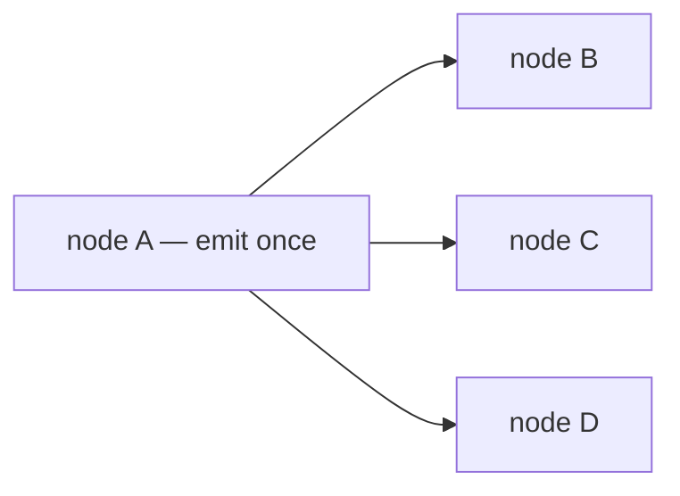
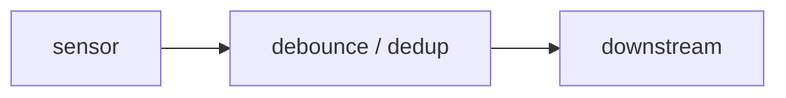
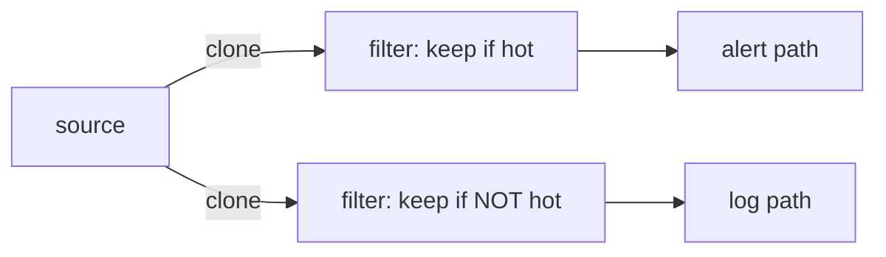
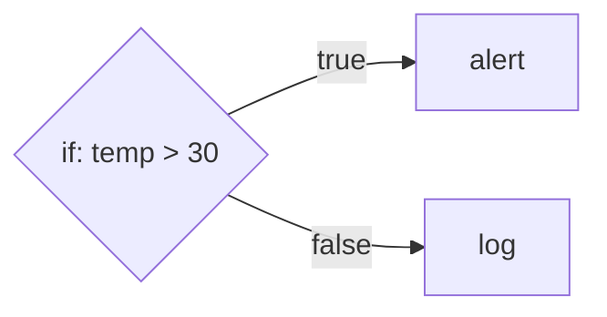
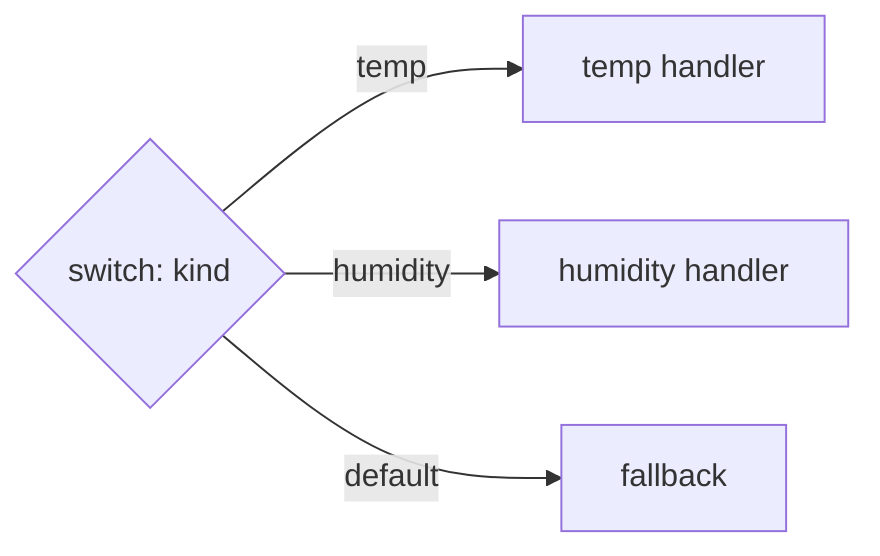
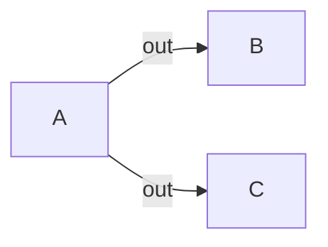
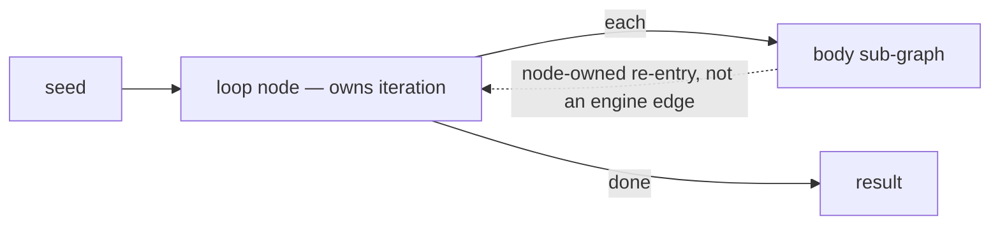
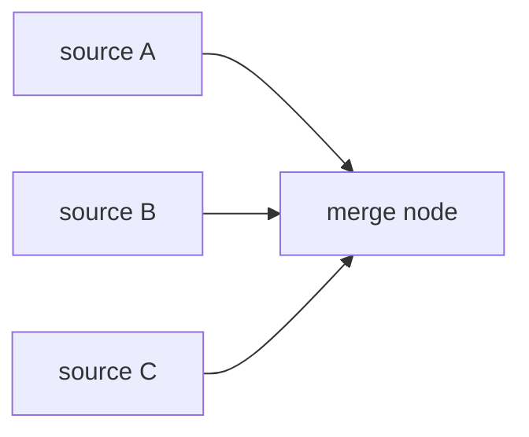

# RFC: Named Output Ports

> **Status: implemented.** Shipped end to end: the `Emit::emit_to` contract +
> `ActorCreator::output_ports`, the engine's nested per-port edge table with
> `add_edge(from, port, to)` validation (`EngineError::UnknownPort`) and
> per-`(node, port)` route counters, the `send-to` WIT import wired through the
> wasm/lua hosts, and the `if` / `switch` builtins over a `Condition` enum
> (declarative `field`/`op`/`value` with `all`/`any`, plus the minijinja `expr`
> arm). Stands as the durable design record.

## Concept

Give every actor more than one logical output. An actor emits to a **named port**
(`"out"` by default, but also `"true"`/`"false"`, `"case-a"`, `"error"`, …); the
graph connects `(source, port)` to targets; routing delivers an emission only to
the successors wired to the port it was emitted on. A port is part of the *node's
interface*, not the topology — the node chooses which of its own outputs to use,
and the graph still decides which actor each output reaches. The neighbor-ignorance
principle holds: a node names a port, never a peer.

## What we have today

Routing is **static fan-out**. An actor has exactly one output: its single `emit`,
which the engine clones to *every* successor (`fuchsia-engine`'s `router.rs::route`
loops all edges; the WIT `emit.send` doc literally says it "fans out the payload
across all outgoing edges").



Every emission reaches B *and* C *and* D. That is the *only* shape the engine can
express. There is no way for A to say "this one goes to B, that one goes to C" —
the node cannot select an output, because it only has one.

## Why conditioning operators don't solve branching

It is tempting to think you can bridge two nodes with a `debounce` or `dedup` to
get conditional flow. You can't — those are **unary** operators: one input, one
output. They decide *whether* a message passes (suppress a duplicate, rate-limit,
ignore a sub-threshold change), never *where* it goes.



A `debounce` on the edge A→B gates that one edge; it has nowhere else to send. So
to fake an IF you fall back to a **filter actor per branch** — every branch gets a
copy and re-checks a predicate:



This is the tax: O(branches) clones and predicate evaluations on every message; no
first-match and no clean default; and the author must hand-maintain that the branch
predicates are mutually exclusive (get it wrong and a message goes both ways, or
nowhere). For an n8n-/HA-style orchestrator where branching is in nearly every
flow, that's untenable.

The fix is not a smarter operator — it's giving a node **more than one output**.

(To be clear, conditioning operators stay useful: `debounce`/`deadband`/`dedup` are
genuinely one-in/one-out and bridging an edge with them remains the right model.
Ports address the *branching* shape, which is a different thing.)

## Design

**`fuchsia-actor` (contract).** Extend the `Emit` capability with a port-addressed
send; keep the existing single-arg form as the default port so current actors are
unchanged:

```rust
pub trait Emit: Send + Sync {
    fn emit_to(&self, port: &str, msg: Message);
    /// Convenience: emit on the default `"out"` port.
    fn emit(&self, msg: Message) {
        self.emit_to("out", msg);
    }
}
```

**`fuchsia-engine` (router).** Key edges by source node, then by port — a *nested*
map so the hot path probes the inner map by `&str` with no per-emit allocation (a
flat `(ActorId, Port)` tuple key can't be looked up from `(&ActorId, &str)` without
constructing the owned key each time):

```rust
// was: edges: HashMap<ActorId, Vec<ActorId>>
edges: HashMap<ActorId, HashMap<Port, Vec<ActorId>>>,   // Port = String; see Decisions
```

`add_edge` gains a port (`add_edge(from, "true", to)`); `route(source, port, msg)`
looks up `source`'s inner map, then `port`'s successors, and offers to each — a port
may still have *multiple* successors, so fan-out *within* a port is preserved.
`RoutedEmit` implements `emit_to` by passing its `source` plus the port into `route`.
`remove_graph(group)` still removes by source group (dropping each node's whole inner
map), so teardown is unaffected.

Two things ride along on the router, both decided below (see [Decisions](#decisions)):
`add_edge` **validates** the source port against the node's declared output ports —
rejecting a typo'd or non-existent port up front — and every `route` call records its
outcome (`delivered` / `shed` / `no-route`) on a per-`(node, port)` counter, so *no*
routing outcome — including an emit to an unwired port — is silent.

**`wit` (guest contract).** `emit.wit` gains the port, additively:

```wit
/// Send a typed payload on a named output port. `out` is the default.
send-to: func(port: string, msg: payload) -> result<_, string>;
send:    func(msg: payload) -> result<_, string>;   // = send-to("out", msg)
```

The host's `emit` implementation maps `send-to` onto `emit_to`. Existing components
that only call `send` keep working on the default port.

**`fuchsia-actor-builtins`.** The first port-using nodes ship here: a generic `if`
builtin (a predicate over the payload → `"true"`/`"false"`) and a generic `switch`
builtin (a key extractor → one of several named case ports, falling back to
`"default"`). These are *node types* — registered once under `"if"`/`"switch"` —
not bespoke actors.

### Where the predicate lives (it's configuration)

`temp > 30` is **not** coded into an actor. It lives in the `if` node *instance's*
`settings` — the opaque `bson` document every node carries — exactly the way
`debounce` reads `{ "delay_ms": 500 }` from its settings (`DebounceConfig`,
deserialized via the builtins' `from_settings` helper). The actor *code* is a
generic evaluator written once; each *use* in a graph is a configured instance. An
author drops an `if` node into the graph, fills in its condition, and wires its
`true`/`false` ports — no code:

```json
// node: { "type": "if", "settings": <below> }, with true/false wired downstream
{ "field": "temp", "op": "gt", "value": 30 }
```

How expressive that config is is **not one choice** — the two target products want
different shapes, so the predicate is a `Condition` enum and a product picks the arm.
Declarative needs no tag (it's the common case); an `expr` key selects the expression
arm:

```rust
#[serde(untagged)]
enum Condition {
    Expr { expr: String },       // a minijinja expression, e.g. "temp > 30"
    Declarative(DeclCondition),  // { field, op, value }, with all/any groups
}
```

- **Declarative conditions (the tagless default).** A small schema the `if`/`switch`
  builtins interpret: `field` / `op` / `value`, combinable with `all`/`any` groups.
  Pure data, no embedded language — exactly Home Assistant's `numeric_state`/`state`
  conditions and n8n's IF condition rows. `{ "field": "temp", "op": "gt", "value": 30 }`.
- **An expression string — `{ "expr": "temp > 30" }`.** Evaluated by
  [minijinja](https://docs.rs/minijinja) (`compile_expression` over the payload as
  context) — the n8n-style `{{ … }}` expression path. More power, a syntax to learn,
  one new dependency and a payload→context shim.
- **A script node (the escape hatch).** When logic is genuinely arbitrary, the
  author uses a Lua/JS node that calls `emit_to("true"/"false", …)` itself. Logic as
  code, *by choice* — not a `Condition` at all.

Both `Condition` arms ship: the **declarative** arm covers the Home Assistant path
and lands first; the **`expr`/minijinja** arm covers the n8n path and lands as its
own phase behind the same enum — one match arm and a crate, not a re-design. The enum
itself is the load-bearing decision; shipping only declarative *without* it would
force exactly that re-design later. The script node remains the escape hatch for
genuinely arbitrary logic. See [Decisions](#decisions).

### What configures a node's ports

A port is **not a node** — it is a named output *on* a node, part of the node's
interface. Two things are easy to conflate:

- **Which ports a node has** comes from the node's *type + config*:
  - *Fixed by the type* — `if` always has `true`/`false`; a `passthrough` has
    `out`. Baked into the generic evaluator; not configurable.
  - *Derived from config* — a `switch`'s ports are its configured cases plus
    `default`. Listing the cases in `settings` *is* configuring its ports:
    `{ "key": "kind", "cases": ["temp", "humidity"] }` → ports `temp`, `humidity`,
    `default`.
  - *Author-defined* — a Lua/JS node has whatever ports its script emits on via
    `emit_to(...)`; the author may also declare them in `settings` purely so an
    editor can draw them.
- **What each port connects to** is the *edge*. An edge names the source port it
  leaves from — `add_edge(from, "true", to)`; an omitted port means `"out"`. Port
  *selection* happens at the source end of an edge; the node never names a peer.

The engine does not *need* a declaration to route — routing is a `(node, port) →
successors` lookup. But a declaration earns its keep for **authoring and
validation**, and this RFC ships one (see [Decisions](#decisions)): an `ActorCreator`
advertises its output ports, computed from type + config, via
`fn output_ports(&self, config) -> OutputPorts` —

- `Fixed(Vec<String>)` — `if` → `["true", "false"]`, `passthrough` → `["out"]`; the
  config-*derived* case is the same variant computed from settings (`switch` → its
  `cases` + `["default"]`).
- `Dynamic` — a Lua/Wasm/JS script node, whose ports exist only at emit time and so
  *cannot* be validated. The honest answer for guests, not a gap.

The default method returns `Dynamic`, so every existing creator compiles unchanged.
`add_edge` looks the source node's declaration up and rejects an edge from a port a
`Fixed` node lacks (`EngineError::UnknownPort`) — `"out"` is always allowed and
`"error"` is reserved, so the error-branch wiring from
[node failure handling](./node-failure-handling.md) never trips validation; `Dynamic`
nodes accept any port. A graph editor reads the same declaration to draw a node's
outputs.

The serialized graph that carries these edges (with their `from_port`) is a
*product* concern: `fuchsia-engine` exposes only `add_node` /
`add_edge(from, port, to)`; a product's workflow schema and its translation into
those calls live above the runtime.

### Worked example

A reading flows in, an `if` checks it, and the two branches go to different nodes.
Here is the author-facing graph — an **illustrative** product schema; the engine
itself only sees the `add_node`/`add_edge` calls shown below it:

```json
{
  "nodes": [
    { "id": "ingest", "type": "passthrough" },
    { "id": "hot?",   "type": "if",  "settings": { "field": "temp", "op": "gt", "value": 30 } },
    { "id": "alert",  "type": "lua", "settings": { "script": "send-alert" } },
    { "id": "log",    "type": "lua", "settings": { "script": "append-log" } }
  ],
  "edges": [
    { "from": "ingest", "to": "hot?" },
    { "from": "hot?", "from_port": "true",  "to": "alert" },
    { "from": "hot?", "from_port": "false", "to": "log" }
  ]
}
```

Note what is **not** there: no node lists its ports. `hot?` has `true`/`false`
*because it is an `if`* — those names appear only where they're used, on the edges'
`from_port`. The `ingest → hot?` edge omits `from_port`, so it defaults to `"out"`.
The only thing configured *on the node* is its behavior (`field`/`op`/`value`); the
ports are wired *on the edges*.

That graph translates to the engine API one-to-one:

```rust
engine.add_node(id("hot?"), "if",
    &config(json!({ "field": "temp", "op": "gt", "value": 30 })), caps()).await?;
// ... ingest / alert / log added likewise ...

engine.add_edge(id("ingest"), "out",   id("hot?"))?;   // omitted port == "out"
engine.add_edge(id("hot?"),   "true",  id("alert"))?;
engine.add_edge(id("hot?"),   "false", id("log"))?;
```

A `switch` shows ports that come *from* config — its `cases`:

```json
{
  "nodes": [
    { "id": "route", "type": "switch", "settings": { "key": "kind", "cases": ["temp", "humidity"] } }
  ],
  "edges": [
    { "from": "route", "from_port": "temp",     "to": "temp-handler" },
    { "from": "route", "from_port": "humidity", "to": "humidity-handler" },
    { "from": "route", "from_port": "default",  "to": "fallback" }
  ]
}
```

Here the ports `temp` / `humidity` / `default` exist *because* they're the
configured cases — editing `cases` changes the node's ports. A script node is the
third flavor: it picks its ports at emit time, so they live in the code, not config:

```lua
-- a Lua actor; its ports are simply whatever it emits on
if msg.value.temp > 30 then emit_to("true", msg) else emit_to("false", msg) end
```

## Topologies with ports

Ports change *one* axis — a node's outputs — and that one change interacts cleanly
with every routing shape we care about. Walking each:

**IF / else — the canonical case.** A node emits on `"true"` or `"false"`; the
engine routes only the chosen port's edge.



**Switch — one of N, plus default.** The node extracts a key and emits on the
matching case port, falling back to `"default"` when nothing matches. First-match
and default are the *node's* decision, not the engine's.



**Fan-out — preserved, on a per-port basis.** "Fan-out" is a separate axis from
"branching." Broadcast — send the same message to several downstreams — is just a
port with more than one edge, exactly as today:



So the two compose: a node can *choose* a port (branch) **and** that port can have
several edges (fan-out). Today's behavior is the special case "one port (`out`),
many edges."

**Looping — a *node*, not a graph cycle.** It is tempting to read a loop as a
back-edge (`done?` → `step`); because the routing table is a lookup, the engine
*could* record one. We deliberately don't. [DAG enforcement](./dag-enforcement.md)
rejects any cycle-creating edge: a graph cycle has no node whose upstreams ever
clear, which breaks graceful-shutdown's topological drain and lets a tight loop shed
its own iterations on a full mailbox. The parent graph stays acyclic.

Iteration instead belongs to a **loop node over a sub-graph** — a node that owns its
counter and drives a body, exactly as n8n (its Loop / Split-In-Batches node) and Home
Assistant (a `repeat` action) model it. Ports are *necessary but not sufficient*:
they give the loop body its `continue` / `done` branch, but the loop itself is the
node's construct, not an engine back-edge.



So ports give a loop its control flow *without* themselves making the graph cyclic.
The mechanism — a node-invoked sub-graph, or a single bounded back-edge into a loop
node as a sanctioned exception to DAG enforcement — is the **loop-node design's**
call, interacting with [DAG enforcement](./dag-enforcement.md), and is out of scope
here.

**Merging — orthogonal; it's an input-side property.** Fan-in already works: several
nodes share one successor and its single mailbox interleaves their emissions in
arrival order. That's *merge*, not a synchronous join, and output ports don't change
it.



The **dual** of this RFC is a true join/merge node ("combine input 1 with input 2"),
which needs to tell its *inputs* apart — named **input** ports: multiple mailboxes,
or a tag on the delivery saying which input it arrived on. A node has exactly one
mailbox today, so inputs are indistinguishable except by message `%type` or content.
This RFC scopes to *outputs* only, but deliberately keeps that door open (see
[Decisions](#decisions)): an edge is represented as a **named struct**, not a bare
`ActorId` successor, so a `to_port` field is a non-breaking addition later, and
nothing asserts a node has exactly one untagged input — `Delivery` stays open to a
later input-port tag. The symmetry is the point: an output port is source-side
selection on an edge; an input port is dest-side selection on the *same* edge plus a
tag on the delivery.

## Alternatives considered

- **Status quo — filter-actor-per-branch.** No engine change, but O(branches)
  clones + predicate evals, no first-match/default, hand-maintained exclusivity,
  verbose graphs (see the diagram above). Right for the occasional *filter*; wrong
  as the branching primitive.
- **Predicate edges** — the edge carries a condition the engine evaluates before
  routing. Makes the *engine* content-aware and forces an expression language into
  graph config (or a per-edge script evaluator), violating two standing principles:
  "edges are pure `from`/`to`, no per-edge config" and "the engine knows only
  actors + addressing." The branching decision belongs to the node, which already
  has the payload deserialized. Rejected.
- **Overload `payload.%type` as the port** — route by the message's `%type`
  discriminator. Conflates *what the data is* with *where it goes*; `%type` is
  semantic data a node sets for downstream consumers, so hijacking it for routing is
  brittle (a type rename silently reroutes the graph). Rejected.

## Migration

The default `"out"` port keeps every existing actor, guest, and graph working
unchanged. `add_edge` gains the port argument; a two-arg convenience forwarding to
`add_edge(from, "out", to)` keeps existing call sites terse. The rest of the new
surface is additive or defaulted: the `Emit` trait gains a method with a default
body; `emit.wit` gains `send-to`; `ActorCreator` gains `output_ports` defaulting to
`Dynamic` (so every existing creator compiles untouched); and `add_edge` gains one
new failure case, `EngineError::UnknownPort`, alongside the `EngineError::Cycle` that
[DAG enforcement](./dag-enforcement.md) adds — both on a call that already returns
`Result`. No breakage.

## Decisions

Review's open questions are resolved as follows; the design above reflects them.

- **Port identity type → `String`, with a nested edge map.** The port label rides in
  the edge table, written once at `add_edge` and only *borrowed* on the emit path, so
  it is never cloned per message — `Arc<str>` buys nothing here. What matters is not
  allocating to *look it up*, so the table is
  `HashMap<ActorId, HashMap<String, Vec<ActorId>>>` (the inner map probes by `&str`),
  not a `(ActorId, Port)` tuple key. Stays compatible with the separate roadmap
  question of making *ids* `Arc<str>`.
- **Port declaration → yes, on `ActorCreator`, validated in the engine.**
  `fn output_ports(&self, config) -> OutputPorts` (`Fixed(Vec<String>)` / `Dynamic`,
  default `Dynamic`); the engine stores it per node at `add_node`, and `add_edge`
  rejects an edge from a port a `Fixed` node lacks (`EngineError::UnknownPort`).
  `"out"` is always allowed; `"error"` is reserved for the failure-handling branch.
  Guests are `Dynamic` (ports exist only at emit time). Richer editor schema (port
  labels/types) is still deferred — names ship now.
- **Unwired-port / routing observability → solved uniformly in the engine.** Not a
  special case: every `route` outcome is bucketed on a per-`(node, port)` counter —
  `delivered` / `shed` (full mailbox) / `no-route` (no edge, including an unwired
  port). Counters only in this RFC, not an event stream; the closed-target bucket is
  reconciled by [node failure handling](./node-failure-handling.md)'s death detection.
- **Named input ports → out of scope, flexibility preserved.** Outputs only now, but
  an edge is a named struct (not a bare successor) so `to_port` is additive later, and
  `Delivery` stays open to an input-port tag. The join/merge node is future work.
- **Loop semantics → no graph cycle; loop is a node.** The parent graph stays acyclic
  ([DAG enforcement](./dag-enforcement.md)); ports supply the loop's `continue`/`done`
  branch, the iteration belongs to a loop node over a sub-graph. The mechanism
  (node-invoked sub-graph vs a single sanctioned bounded back-edge) is the loop-node
  design's call, deferred.
- **Predicate representation → a `Condition` enum, both arms shipped.** Declarative
  (`field`/`op`/`value` with `all`/`any`) for the Home Assistant path lands first; a
  minijinja `expr` string for the n8n path lands as its own phase behind the same
  enum. The enum is the load-bearing decision; only declarative-*without*-the-enum was
  rejected. The script node stays the escape hatch.

### Still open

- **`UnknownPort` / `Cycle` error detail** — name just the offending edge, or the
  full context (a `Fixed` node's available ports, the cycle path)? The richer form is
  friendlier for a graph editor to surface; edge-only is the simpler default.
- **`expr` evaluation context** — the exact payload→minijinja `Value` mapping (field
  access, missing-field semantics, type coercion) is settled when the `expr` phase
  lands.
- **Routing counters' surface** — kept to in-process counters here; whether they
  graduate to a metrics/trace export is a later observability decision.
