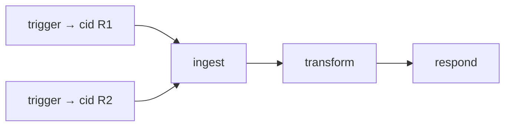
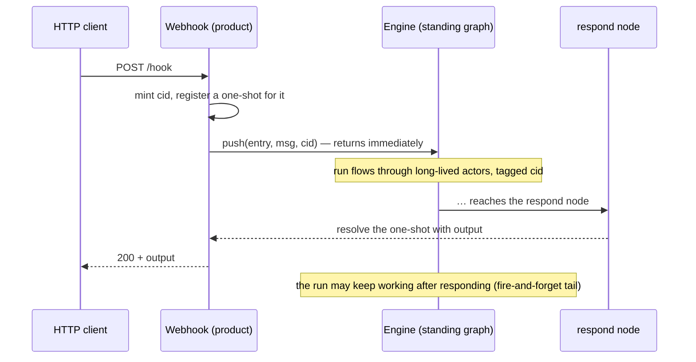

# RFC: Runs & Result Correlation

> **Status: proposed.** Tracked in the [roadmap](../reference/roadmap.md#features)
> Features table. Builds on
> [per-message correlation id](./message-correlation-id.md).

## Concept

A workflow is a **persistent graph of long-lived actors**, provisioned once. A
*run* is not a fresh graph — it's a message tagged with a
[correlation id](./message-correlation-id.md), pushed into the standing graph and
propagated through it. `push` is **fire-and-forget**: it returns immediately and the
run proceeds asynchronously. When a caller needs the run's output (a synchronous
webhook), it *opts in* to result correlation — a `respond` node resolves a result
sink keyed by the correlation id, which the caller awaits with a timeout. Hard
isolation, if ever needed, is a separate engine instance, not a per-run graph.

## Motivation

The runtime's actors are long-running by design — `setup` once, `handle` many. A run
should ride that grain, not fight it: provisioning and tearing down a graph per
trigger would re-pay actor (and Wasm/Lua/JS guest) instantiation on every event and
contradict the lifecycle. And workflows can take minutes — blocking a trigger until
the whole run completes is wrong. So: push a correlation-tagged message into the
standing graph and return; concurrent runs interleave through the shared actors,
told apart by their correlation id. Synchronous responses are the exception, handled
explicitly, not by blocking on whole-run completion.



One persistent graph; runs R1 and R2 interleave through the same actors, told apart
by correlation id.

## Design

**Persistent graph; a run is a message.** Provision the workflow once (deploy). A
trigger is simply:

```rust
engine.push(&entry, msg, CorrelationId::new())?;   // returns immediately; run proceeds async
```

Nothing is spawned or torn down per run.

**Fire-and-forget by default; result correlation is opt-in.** For an async trigger
(an HA state-change, a queue) you push and forget — return `202 accepted, run_id=…`
if any caller is waiting at all. For a synchronous trigger (an n8n webhook that
returns data) the product:

- registers a one-shot keyed by the correlation id *before* pushing,
- wires a terminal `respond` node that resolves it (a `ResultSink` capability keyed
  by the current correlation id),
- awaits the one-shot with a timeout, then returns.



This is `Ack::Complete` (`fuchsia-transport`) lifted from *one hop* to a
correlation-keyed, whole-graph result — but **decoupled from run completion**: the
respond node fires when the *answer* is ready, and the run may keep doing work after.
For long workflows the trigger simply doesn't wait — it returns the run id and lets
the run proceed.

**Concurrent runs share long-lived actors — state must be keyed by run.** Because one
actor's `&mut self` is shared across every run flowing through it:

- **Stateless nodes** (map, filter, HTTP call — most of them) are unaffected; each
  message is independent.
- **Stateful-per-run nodes** (accumulate items for *this* execution; join two
  branches of *this* run) must key their state by correlation id and evict it when
  the run ends.

**No per-run teardown. Ephemeral = a separate engine.** Teardown happens only on
**redeploy** (`remove_graph` replaces a workflow's graph) or **engine shutdown** (a
graceful-shutdown story, specified separately). If a caller needs hard isolation — a
dedicated tenant, a throwaway sandbox — it stands up a separate `Engine`.

**Run-completion detection is deferred.** Fire-and-forget with stateless nodes needs
no notion of "done." It's needed only for (a) per-run state eviction in the rare
stateful node and (b) execution history ("run finished at T"). When we add those, the
engine can compute it by reference-counting in-flight messages per correlation id
(incrementing on push/emit, decrementing on handle, accounting for pending timers)
and signalling quiescence at zero — machinery that overlaps with graceful shutdown's
"wait until settled." Until then, stateful nodes self-manage (a TTL or an explicit
"final" message), and the result sink relies on the caller's timeout.

The engine owns `push` and the standing graph; the **product** owns the trigger
source and the `respond` node — the runtime stays product-agnostic.

## Alternatives considered

- **Ephemeral graph per run (group = run id), torn down on completion.** The original
  proposal. Clean isolation, but it re-spawns actors (and re-instantiates Wasm/JS
  guests) on every trigger and fights the long-running-actor lifecycle. Rejected as
  the model; available as "a separate engine per tenant/sandbox" when hard isolation
  is actually needed.
- **Block the trigger until the whole run completes.** Simple request/response, but
  wrong for minutes-long workflows and couples the caller's latency to the slowest
  path. Rejected — the respond node decouples *answer-ready* from *run-complete*.
- **Poll an execution store for the result.** The trigger writes the run id; the
  client polls. The right shape for genuinely long/async jobs, and it complements
  fire-and-forget, but it can't serve a cheap synchronous response. Kept as a
  complementary mode, not a replacement.

## Open questions

- **Result sink shape.** A `ResultSink` capability in terminal nodes' bags, or a
  host-side `correlation_id -> oneshot` map the product owns? Leaning toward a
  product-owned map plus a thin `respond` node.
- **Per-run state eviction / completion.** Deferred (above); revisit with execution
  history. Default eviction for stateful nodes — engine quiescence signal, TTL, or an
  explicit final message?
- **Multiple responses / streaming.** Can a run respond more than once (progress
  events, SSE)? The one-shot model says no; a streaming result needs a channel.
- **Unawaited results.** If the caller has already timed out when `respond` fires,
  the resolution is dropped — fine, but should that be observable (a counter)?
