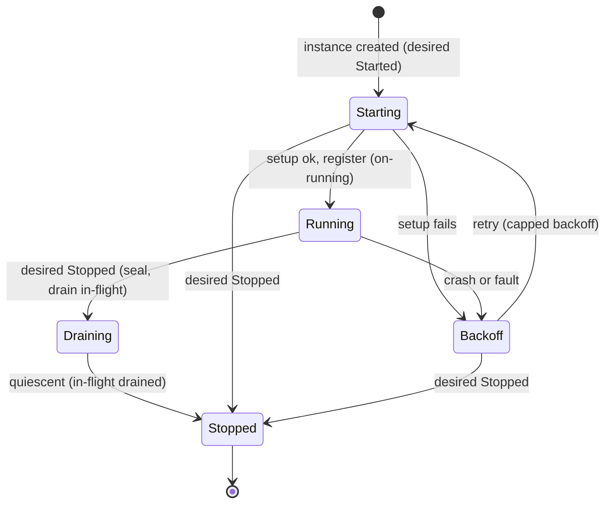
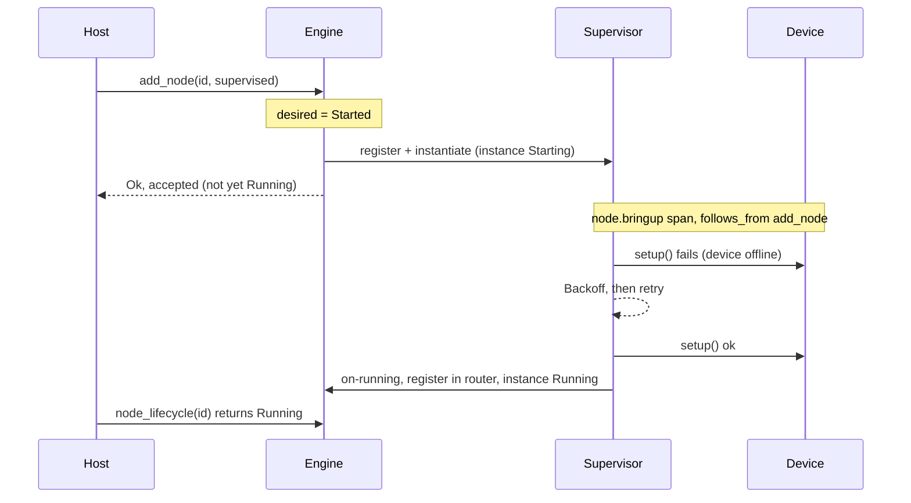

# RFC: Supervised Node Lifecycle

> **Status: proposed.** Tracked in the [roadmap](../reference/roadmap.md#features)
> Features table until it lands. Began as "make bring-up supervised like death"
> and generalized into one node lifecycle; it **revises**
> [Node Failure Handling](./node-failure-handling.md)'s permanent-death into
> CrashLoopBackOff. Its bring-up trace is the
> [observability](./observability.md) `node.bringup` root, and its per-instance
> `Actual` state — including `Draining` — is the accept-state
> [Lifecycle-Gated Routing](./lifecycle-gated-routing.md)'s gate reads.

## Concept

Model a node's whole life as a **controller**. A durable **registration** (the
node) carries a host-set **desired state** (`Started` / `Stopped`), and one or
more **instances** are reconciled toward it — each instance with an **actual
state** the supervisor drives: `Starting → Running → Draining → Stopped` (plus
`Backoff` on a fault).

Birth and death stop being separate mechanisms: **a failed bring-up and a crash
are the same event** — an instance dropping to `Backoff` and retrying
(CrashLoopBackOff). A node never gives up on its own; it backs off (capped) until
it comes `Running`, or until the host sets desired `Stopped`. The synchronous
fail-fast `add_node` stays for callers who want "is it up?" on return; the
supervised, reconciled lifecycle is opt-in.

## Motivation

fuchsia is the engine under an IoT/automation hub, so a node's lifecycle has two
gaps the current model can't express — one at birth, one at death:

- **Birth is unsupervised.** A driver's `setup()` does fallible, blocking I/O — an
  MQTT connect, a BLE pair, an HTTP registration. Today `Engine::add_node` does
  `prepare` → `spawning.setup().await?` → `commit`; the `?` errors a failed
  initial `setup()` *out* of `add_node`, and the node never `commit`s, so it never
  enters the supervisor. No retry, no bring-up state — a control-plane call **fails
  or blocks** when a device is merely offline.
- **Death is terminal.** Node-Failure-Handling parks a node permanently-dead once
  it exhausts `max_restarts`. For a hub where devices come and go, that's wrong: a
  sensor offline for an hour shouldn't *permanently kill* its node.
- **There is no liveness phase.** `Health` is runtime counters only; nothing says
  "still coming up" vs "live" vs "backing off."

One reconciled lifecycle closes all three: bring-up becomes a supervised,
observable phase; death becomes CrashLoopBackOff (keep trying) instead of a
terminal park; and a node gains an observable state a host reconciler reads.

## Design

### Three levels of identity

- **Registration** (`node_id`) — the durable node: its recipe (kind + config +
  caps) and its desired state. One per graph node. Can spawn **many** instances (1
  today; a round-robin pool later).
- **Instance** (`generation`) — a created actor object. Minted at `create()`;
  `setup` is its *boot phase*, not the instance itself. Carries an *actual state*.
- (Orthogonal: `invocation_id` — one `handle` call — the per-message id, renamed
  from `task_id`. Not a lifecycle concept.)

### Desired vs. actual — the controller

- **Desired** lives on the **registration**, set by the host: `Started | Stopped`
  (+ `Paused` later). Implicit today (`add_node` ⇒ `Started`, `remove` ⇒
  `Stopped`); explicit `start`/`stop`/`pause` actions later.
- **Actual** lives on each **instance**, driven by the supervisor: `Starting |
  Running | Draining | Backoff | Stopped`.
- **Two levels of reconciliation**, which is the whole point: the **supervisor**
  drives *instance actual → node desired* (low-level, like a kubelet); the **host**
  reconciler sets *desired* and watches *actual* (high-level, like a Deployment
  controller).
- **Node health = desired + the multiset of instance actual-states + counts.**
  E.g. desired `Started`, actual `{4 Running, 1 Backoff}` → *degraded but serving*.

### The instance state machine (CrashLoopBackOff)



A **failed `setup`** and a **crash** both land in `Backoff` — that's the
unification of birth and death. `Backoff ⇄ Starting` loops (capped) as long as
desired is `Started`; the **only terminal state is `Stopped`**, and it is always
**intentional** (desired `Stopped`). So an abnormal failure is never terminal —
it retries; only the host stops a node.

The graceful stop path — `Running → Draining → Stopped` — runs through **`Draining`**:
on `desired = Stopped` the instance **seals** (its ingress stops accepting new runs
while in-flight continuations drain), then reaches `Stopped` once quiescent or the
`teardown_deadline` fires. `Draining` is the per-node accept-state the gate reads in
[Lifecycle-Gated Routing](./lifecycle-gated-routing.md); crash (`Running → Backoff`) and
bring-up (`Starting` / `Backoff → Stopped`) **skip** it — no running instance means
nothing in flight to drain.

### This revises Node-Failure-Handling

NFH today gives up after `max_restarts` → parks permanently-dead. This RFC
**replaces that terminal give-up with CrashLoopBackOff**: an instance retries
(capped backoff) indefinitely while desired is `Started`, and the *"this node is
hopeless"* judgment leaves fuchsia entirely — the **host** watches a node stuck in
`Backoff` and sets desired `Stopped` (or alerts). `max_restarts` no longer
*terminates*; at most it escalates the backoff cap or flags "unhealthy" while
still retrying.

- *Why:* matches an IoT hub (devices come back) and matches k8s CrashLoopBackOff.
- *Trade-off:* a permanently-broken node loops forever — bounded by a **capped**
  backoff, made loud by the visible `Backoff` state, and stoppable by the host.

### `add_node`: registration sync, instantiation async

| | Fail-fast (today, default) | Supervised (opt-in) |
|---|---|---|
| **registration** (resolve kind, record recipe + desired `Started`) | sync; errors return from `add_node` | sync; errors return from `add_node` |
| **instantiation** (`create()` an instance → `setup()`) | `setup` **awaited**; `?` returns from `add_node` | **deferred** to the supervisor; on fault → `Backoff`, retried |
| router registration | in `add_node`, after `setup` | on the **on-running seam**, once an instance is `Running` |
| `add_node` returns | once the node is `Running` | once **accepted** (registered, an instance `Starting`) |

So the sync boundary is at **registration** — an unknown `type_name` or bad config
fails *there*, immediately, in both modes. Everything that touches an *instance*
(`create()` + `setup()`) is async/supervised in the opt-in mode. Supervised
`add_node` returns `Ok` = *accepted*, and the host watches `node_lifecycle`.

The **on-running seam** is the mirror of the existing `on_death` deregister seam:
the runtime tells the engine "this instance is `Running`," and the engine
registers it as a routable target (the same `register` revival uses). A node in
`Starting`/`Backoff` is **not registered** — an emit to it reads `no_route` until
it's `Running` (exactly as a dead node deregisters and a revived one
re-registers), so routing never reaches a half-built instance.



### `push_durable` to a not-yet-`Running` node

A durable feeder delivering to an entrypoint that isn't `Running` **waits for
`Running`**, bounded by the node's `startup_deadline` (and the caller's own lease
timeout, whichever fires first). On expiry it returns a **retriable**
`Unavailable`/`Lost` — *not* `NotFound` (which would wrongly tell the feeder to
*drop* a job aimed at a node that's 200 ms from up). The feeder retries; the
node's reconciliation brings it up.

### Policies — split `FailurePolicy` along lifecycle vs. delivery

Today's `FailurePolicy` mixes two unrelated axes. Split it:

| | **`LifecyclePolicy`** (the instance exists / recovers) | **`DeliveryPolicy`** (a message is handled) |
|---|---|---|
| owns | `bringup: FailFast \| Supervised{…}`, instance `backoff` (CrashLoopBackOff), `startup_deadline`, `teardown_deadline` | `on_error: Continue \| Fail \| Retry{…}`, `poison_after`, dead-letter |
| answers | "is the node up, and how does it recover?" | "what happens to *this message*?" |
| from `FailurePolicy` today | the `restart` half | the `on_error` + `poison` half |

- **`Backoff` is a shared strategy type** both use: `Fixed`, `Linear { cap }`,
  `Exponential { factor, cap, jitter }`. Default for the lifecycle loop is
  **exponential + jitter + cap** — jitter specifically matters here, so a hub of
  devices reconnecting at once doesn't produce synchronized retry storms.
- Both policies are **engine-default + per-node override**.
- **Deadlines live on the node config**: `startup_deadline` bounds bring-up
  *waits* (and is what `push_durable` waits on); `teardown_deadline` bounds
  graceful stop. They're lifecycle timing, not failure handling — hence they sit in
  `LifecyclePolicy`, not `DeliveryPolicy`.
- **Desired state is *not* a policy** — it's a settable intent, separate from both.
- *(Optional refactor: a thin `NodePolicy { lifecycle, delivery }` umbrella so a
  node's whole config is one struct. Noted, not required.)*

### The observable

```rust
// fuchsia-engine — the lifecycle analog of `route_counts`.
pub fn node_lifecycle(&self, id: &ActorId) -> Result<NodeLifecycle, EngineError>;

pub struct NodeLifecycle {
  pub desired: Desired,                       // Started | Stopped (| Paused)
  pub instances: Vec<(Generation, Actual)>,   // per-instance actual state
  pub running: usize,                         // healthy count (0/1 today, N pooled)
}
```

This is the primitive a host reconciler polls — and the admin visibility you want
("is it up, how many instances, which are backing off"). `running == 0` while
desired `Started` is a node the host should act on.

### Observability tie-in

Each instance's bring-up is a **`node.bringup` root span** (`parent: None`,
`follows_from` the `add_node` call), tagged with its `generation`, with
`actor.setup` nested **per attempt** and the actual-state transitions as events.
Like all lifecycle work it carries **no correlation** (it's not a run — the
[two-identities rule](./observability.md)); the node id + the link are the
correlator.

### Layer ownership

- `fuchsia-actor` — `LifecyclePolicy` / `DeliveryPolicy` + the `Backoff` type; the
  opt-in.
- `fuchsia-transport` — the instance `Actual` state (beside `Health`) + the
  `Generation` id.
- `fuchsia-runtime` — the supervisor **as the instance controller**
  (`Starting/Running/Backoff/Stopped`, CrashLoopBackOff), the on-running seam, and
  setting state. Reuses `supervise_with_restart` — *no parallel loop*.
- `fuchsia-engine` — on-running → router `register`; `add_node` dispatch + the
  *accepted* return; `node_lifecycle`; the desired-state intent (+ future
  `start`/`stop`/`pause`).
- **host** — high-level reconciliation (set desired, watch actual, decide "give
  up"), persistence, entity / API concepts, the device subscriptions.

## Alternatives considered

- **Status quo** (fail-fast birth + give-up death). Forces the host to block its
  API on device I/O *and* to re-create permanently-dead nodes itself. Rejected.
- **Give-up-after-budget (today's NFH) instead of CrashLoopBackOff.** Rejected for
  a hub — a transient-offline device shouldn't permanently kill its node; the
  host owns "give up" via desired `Stopped`.
- **A separate "provisioner."** Rejected — duplicates the supervisor's
  build→setup→retry loop; birth and death are one machine.
- **Make supervised the default** (drop the fail-fast `?`). Rejected as breaking —
  callers rely on `add_node` returning a setup error.
- **Register the node before `Running`** (mailbox buffers during bring-up).
  Rejected — sheds before the node can handle, and routes to a half-built instance.
- **One `FailurePolicy` for everything.** Rejected — it conflates lifecycle and
  delivery; the split makes each cohesive.

## Test plan

- Supervised bring-up, `setup` fails N times then succeeds: `add_node` returns `Ok`
  immediately; `node_lifecycle` walks `Starting → Backoff → … → Running`; routable
  only at `Running`; `setup` ran N+1 times (idempotency).
- CrashLoopBackOff: a node whose device stays offline stays in `Backoff`
  indefinitely (never `Stopped`/terminal), with the backoff honoring the cap.
- Desired `Stopped`: a `remove`/`stop` on any state lands the instance in `Stopped`
  (graceful teardown), the only terminal.
- Fail-fast unchanged: a `setup` error still returns from `add_node`; the node
  never registers as routable; no `Starting` observable.
- `push_durable` to a `Starting` node: waits, then delivers on `Running`, or returns
  a retriable error on `startup_deadline` (not `NotFound`).
- Observability: a `node.bringup` root `follows_from` the `add_node` call, carrying
  `generation`, with `actor.setup` per attempt.

## Host vs. fuchsia boundary

- **fuchsia** owns the **mechanism**: the supervised instance controller
  (Starting/Running/Backoff/Stopped + CrashLoopBackOff), the `Lifecycle` /
  `Delivery` policies, the on-running seam, `node_lifecycle`, and the `node.bringup`
  span. It never learns what a "device," an "entity," or an "HTTP 201" is.
- **the host** owns the **policy + semantics**: high-level reconciliation (set
  desired, watch actual, decide when a `Backoff` node is hopeless → `Stop` / alert),
  config persistence, the durable identity, and the device/transport subscriptions.

## Open questions

- **Pool model.** When one registration → N instances, are they stateless replicas
  (a dead one replaced by a new identity, maintain a count) or stateful slots
  (stable per-slot identity, recreated in place)? Future; the registration/instance
  split supports either.
- **`max_failures` after dropping terminal give-up.** Does it survive as a
  "flag unhealthy / escalate the cap after N" signal, or disappear entirely in
  favor of pure capped backoff? (Leaning: a soft "unhealthy" flag, never a
  terminator.)
- **`Paused` semantics** (future). Does `Paused` keep the instance `Running` but
  un-routed (warm), or tear it down to a cold registration?
- **`NodePolicy` umbrella.** Group `LifecyclePolicy` + `DeliveryPolicy` under one
  struct, or keep them separate? (Cosmetic; defer.)
- **Backoff defaults.** Concrete `factor` / `cap` / jitter values for the lifecycle
  loop — tuning, not structure.
